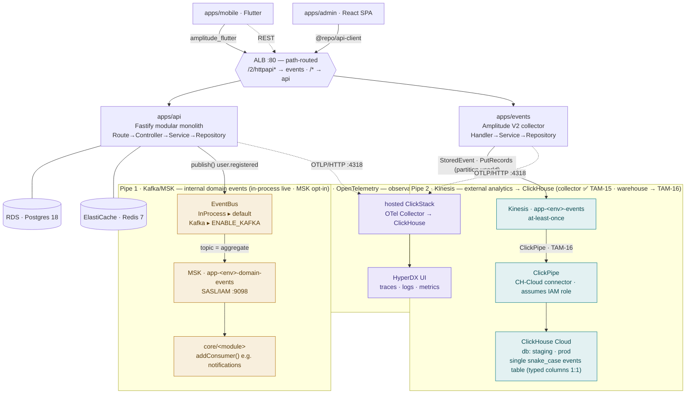

# Architecture

The workspace is an Nx monorepo. Two backend services — `apps/api` (Fastify modular monolith) and
`apps/events` (client-analytics collector) — run as **ECS Fargate** tasks behind one **ALB** per
environment (`stage`, `prod`), each in an isolated VPC. Three **independent event pipes** carry
three different concerns; they do not overlap (different producers, transports, consumers,
guarantees).

> The diagram below is Mermaid — it renders on GitHub and in VS Code's Markdown preview
> (Mermaid support). Colour = pipe: 🟨 Kafka, 🟦 Kinesis, 🟪 OpenTelemetry.



## The three pipes

| Pipe              | Concern                                  | Producer → Consumer                             | Guarantee                         | Status                                                                             |
| ----------------- | ---------------------------------------- | ----------------------------------------------- | --------------------------------- | ---------------------------------------------------------------------------------- |
| **Kafka / MSK**   | internal state changes between modules   | `apps/api` module → other `apps/api` module     | ordered per aggregate, replayable | in-process live; MSK transport prod-ready, app-wiring opt-in (`kafka_app_enabled`) |
| **Kinesis**       | external user behaviour (analytics)      | mobile (Amplitude SDK) → ClickHouse (ClickPipe) | at-least-once, dedup downstream   | collector generic ✅ **TAM-15**; warehouse + ClickPipe IAM → **TAM-16**            |
| **OpenTelemetry** | operational telemetry about the services | `api` + `events` → hosted ClickStack            | fire-and-forget, opt-in           | ✅ **TAM-14**                                                                      |

## Pipe 2 — the analytics seam (`StoredEvent`)

`apps/events` maps each Amplitude V2 event to one **scoped `StoredEvent`** JSON record on Kinesis —
the contract the ClickHouse warehouse (TAM-16) consumes (full table:
[`ANALYTICS-EVENT-CONTRACT.md`](ANALYTICS-EVENT-CONTRACT.md)):

```
identity:  user_id(setUserId) · device_id · pseudo_id
event:     insert_id · event_type · session_id · event_seq_id · event_time (epoch ms)
scopes:    event_properties{} · user_properties{} · groups{} · group_properties{}   (JSON objects, types preserved)
context:   platform · os_version · app_version · device_model · carrier · country · language · adid …
server:    req_guid · server_time        diag: attempts · retry_count
```

`$identify` events (user-state changes — client SDK or server producers) are **skipped at the
collector** (kept at 200, no downstream consumer); the wire still defines the shape but the
collector drops it before Kinesis. Warehouse-side persons enrichment (TAM-17) is **deferred**.

Downstream (TAM-16): a **single snake_case `events` table** (33 columns, one per field) — ClickPipe
writes each `StoredEvent` field **directly** into its typed column (a clean 1:1 by field name, no
overrides): epoch-ms integers → `DateTime64`, JSON objects → `JSON` / the `groups` `Map`, context
flat → its typed columns. No landing table, no materialized view, no camelCase raw duplicates. Only
three columns are computed on insert, all `MATERIALIZED` (`corrected_time`, then `event_date` =
`toDate(corrected_time)` and `synthetic_sequence_time`, both derived from it).
`events` is an **append SharedMergeTree** (wide, `PARTITION BY toYYYYMM(server_time, 'Asia/Kolkata')`
— the server-receive month in IST, so late/offline events don't scatter into stale partitions — dedup
by `insert_id` at query; timestamps stored tz-naive `DateTime64(3)` (UTC — ClickPipe forbids tz-typed
columns), IST applied at the calendar boundaries; plus a skew-corrected `corrected_time` and a
`synthetic_sequence_time` ordering key). Funnels use `windowFunnel()`
grouped by `user_id`; session journeys via `(user_id, session_id, event_time)`. `user_properties`
is the client snapshot as-sent on each event (still point-in-time); the TAM-17 server-side
merge/stamp of accumulated user state is currently **deferred** (persons layer removed pre-release).

## Infrastructure (Terraform)

Two isolated envs (`infra/terraform/envs/{stage,prod}`, separate state + VPC) over a shared
`modules/stack`. Adding a service = one module block. `floci-aws` emulates AWS locally
(`docker compose up` + `pnpm deploy:local`).

`ECS Fargate ×2` · `ALB (path-routed)` · `RDS Postgres 18` · `ElastiCache Redis 7` ·
`Kinesis` · `MSK (opt-in)` · `Secrets Manager` · `ECR` · `ClickPipe reader IAM (TAM-16)`

## See also

- [`docs/EVENT-ARCHITECTURE.md`](EVENT-ARCHITECTURE.md) — the two business pipes (Kafka domain events, Kinesis analytics) in depth
- [`docs/OBSERVABILITY.md`](OBSERVABILITY.md) — the OpenTelemetry → ClickStack pipe
- [`infra/terraform/README.md`](../infra/terraform/README.md) — the per-env AWS stack
- `specs/TAM-15-generalize-events-mapping.md` · `specs/TAM-14-clickstack-observability.md`
