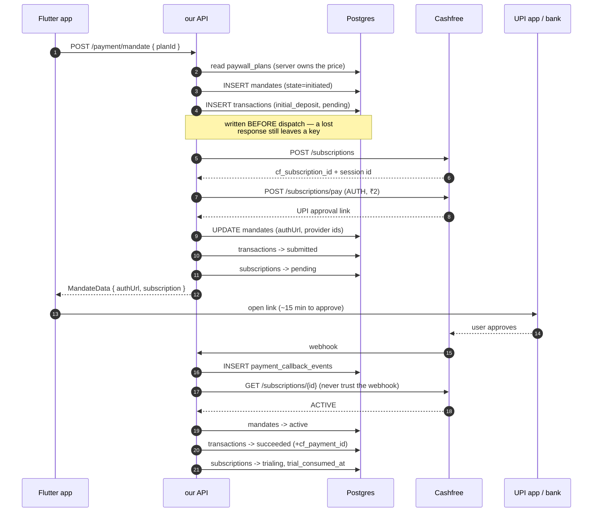
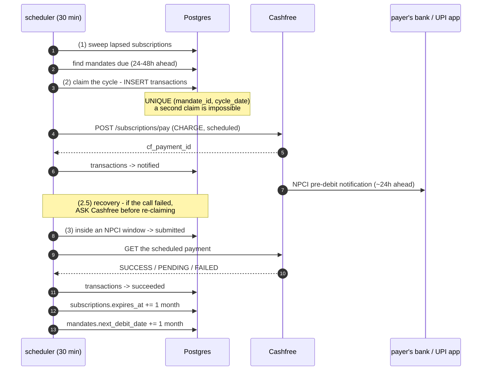

# Payment Flow — UPI Autopay (Cashfree · Decentro · Razorpay)

Every call `apps/api` makes to a payment gateway, the exact payload, and where the result lands in Postgres — from the moment a user taps **Pay now** to a renewed subscription a month later. Cashfree is the worked example throughout Phases 1–2; the Decentro and Razorpay sections below cover where each departs from it.

Adapter: `apps/api/src/core/payment/repositories/cashfree-mandate.repository.ts`. Base `https://api.cashfree.com/pg`, pinned `x-api-version: 2025-01-01`. Endpoint behaviour in this document was **verified live against production on 2026-07-29** (read-only `GET`s; `POST` probes used a deliberately non-existent subscription id, so nothing was chargeable).

Decentro and Razorpay are the second and third fully-implemented adapters behind the same `MandateProvider` interface. They differ in ways that matter and the differences are called out inline — the three are **not** interchangeable in their timing semantics, and since TAM-152 they can run **at the same time** (see "Running two gateways at once" below).

---

## We drive billing — Cashfree does not

We register subscriptions as **`plan_type: "ON_DEMAND"`** and raise every debit
ourselves through NPCI's **controlled flow**. Cashfree schedules nothing.

That is not how this started. The adapter used to register `PERIODIC` — under
which Cashfree charges on its own interval — while `BillingCycleService` also
raised charges, so two schedulers believed they owned billing. It had not
double-charged anyone only because the charge call was hitting a 404. Fixed
together, since the controlled flow *requires* on-demand.

| | before | now |
|---|---|---|
| `plan_type` | `PERIODIC` — Cashfree's schedule | `ON_DEMAND` — ours |
| recurring debit | one `POST /subscriptions/pay` (`CHARGE`), which 404'd | `notify-mandate` → `execute-mandate` |
| who sends the PDN | Cashfree/NPCI, via the payer's bank | **we do**, explicitly |
| `chargePhase` | `notification` | `submission` — notify moves no money |

> **⚠️ Two `PERIODIC` mandates still exist AT CASHFREE.** `plan_type` is fixed at
> registration, so they keep Cashfree's own schedule and will be charged by it
> regardless of what our scheduler does.
>
> Our `mandates` table was emptied on 2026-07-30 and prod now runs on Decentro —
> **which does not cancel them.** The wipe removed our record of them, not the
> standing instruction at the provider. Cancel them at Cashfree directly; there is
> no longer a row here to cancel them through. Still open — see OQ6 below.
>
> This paragraph used to say `POST /payment/callbacks/cashfree` "404s on the
> provider mismatch". It never did, and the truth was worse: the endpoint answered
> **200** `{received:true}` with `"inactive_provider"`, and an acked webhook is
> never redelivered — so a settlement for either mandate was dropped permanently
> and silently rather than retried. That branch is gone (see "Running two gateways
> at once"); a Cashfree callback is now authenticated and ingested, because
> `cashfree` is in the gateway registry and every registered gateway can receive
> callbacks. With no mandate row it still resolves to `ignored_unknown`, but it is
> *recorded* in `webhook_events`.

## The cast

Four tables carry the payment story, and each answers a different question. Keeping them separate is what stops *"did money move?"* and *"may this user watch a video?"* from being the same query.

| Table | Answers | Grows |
|---|---|---|
| `mandates` | Do we have permission to debit, and is it still good? | One row per registration **attempt** — a revoked mandate is replaced, never edited |
| `transactions` | What money moved, when, and what did the gateway call it? | Append-only, forever |
| `subscriptions` | Is this user Pro right now? | Exactly one row per user — never grows, only changes |
| `pdn_notifications` | Has NPCI been told about this debit, and may it be presented yet? | One row per `(mandate, billing day)`, rotated in place on a re-arm |
| `webhook_events` | What did the gateway *claim* happened? | One row per webhook, never trusted alone |
| `payment_provider_api_logs` | What did we send the gateway, and what came back? | Append-only; one row per attempt, including retries |
| ~~`payment_callback_events`~~ | Superseded by `webhook_events` | Read-only history; no new writes |

`pdn_notifications` earns its own table because a notification is not a movement of
money. Decentro's notify API is **asynchronous** — it accepts the notification and
issues the `presentation_sequence_id` later — so resolving one needs a row with its
own status, its own dispatch counter, its own rotating reference and the provider's
raw bodies. None of that belongs on a ledger row whose whole design is
one-row-per-movement, and having nowhere to put it is precisely why the adapter used
to throw on the normal case.

**Ownership, so there is one authority per question.** `transactions` owns MONEY and
keeps sole custody of the anti-double-charge guarantee; `pdn_notifications` owns the
NOTIFICATION. A notification row authorises nothing — money moves only in the
presentation, which is driven off a `transactions` query — so it sits *upstream* of
that gate and cannot bypass it. Conversely a `transactions` row cannot present
without a sequence id only the notification can supply. The two are a **series**, not
two parallel authorities. `transactions.presentation_sequence_id` is a *snapshot* of
what a given attempt used; `pdn_notifications.presentation_sequence_id` is
authoritative.

`paywall_plans` is the menu: the server reads the price from it so a client-supplied amount can never become a client-chosen charge.

---

## Phase 1 — Mandate setup

Signing the standing permission. Ends with ₹2 taken, a live mandate, and the user on a trial.



### 1. Create the subscription

```jsonc
// POST /pg/subscriptions
{
  "subscription_id": "pj_mnd_60d484c7-…",        // ours, already persisted
  "customer_details": {
    "customer_id":    "pj_mnd_60d484c7-…",
    "customer_email": "<user-uuid>@no-reply.prabhuji.app",
    "customer_phone": "98765xxxxx"               // omitted if unknown, NEVER faked
  },
  "plan_details": {
    "plan_name":          "Prabhuji VIP Membership",
    "plan_type":          "ON_DEMAND",           // we raise every charge; Cashfree schedules nothing
    "plan_amount":        299,                   // RUPEES on the wire, paise in our DB
    "plan_max_amount":    299,                   // the ceiling consent covers
    "plan_interval_type": "MONTH",
    "plan_intervals":     1
  },
  "authorization_details": {
    "authorization_amount": 2,                   // paywall_plans.initial_deposit_paise
    "payment_methods":      ["upi"]
  },
  "subscription_first_charge_time": "2026-07-30T00:00:00+05:30",
  "subscription_expiry_time":       "2056-07-29T00:00:00+05:30",
  "subscription_note":              "Prabhuji VIP Membership"
}
```

**Lands in** `mandates` (state, plan, dates, provider ids) and `transactions` (`initial_deposit`, `pending`).

Both rows are written **before** this call. If it times out, Cashfree may still have created the subscription, and `subscription_id` / `gateway_request_id` is the only way to find it again. That is also why `MandateProvider.createMandate` must never be retried by the caller.

`customer_phone` is sent as an **absent field** rather than a placeholder when unknown. Every mandate used to carry the same hardcoded `9999999999`, which made every customer look like one person to Cashfree — useless for reconciliation, for their fraud checks, and for any dispute that starts from a phone number.

`plan_max_amount` is the consent ceiling, and combined with `amount_rule: MAX` on our side it is why a future price rise needs no re-consent *up to that ceiling*. The two mandates still standing at Cashfree were registered at ₹5, so they can never be charged more than ₹5/month — the ₹299 price applies only to mandates registered after it.

### 2. Start the authorization payment

Cashfree's create call returns **no approval link**. A second call mints it — and takes the ₹2.

```jsonc
// POST /pg/subscriptions/pay
{
  "subscription_id":         "pj_mnd_60d484c7-…",
  "subscription_session_id": "<from step 1>",
  "payment_id":              "pj_auth_pj_mnd_60d484c7-…",
  "payment_type":            "AUTH",
  "payment_method": { "upi": { "channel": "link" } }
}
```

`channel: "link"` yields per-UPI-app deep links; we hand the client the default one. `authExpiresAt` is **computed** (now + 15 min) rather than read back, because the client needs an absolute instant to expire the CTA on.

Recurring debits do **not** reuse this route. They go through the controlled flow (`…/pay/controlled/…`) described in Phase 2.

### 3. The user approves

The webhook lands in `payment_callback_events` and is then **ignored as evidence**. We call `GET /subscriptions/{id}` and act on that answer.

That is the central security property of the module: the callback endpoint has no signature verification (this Cashfree account issues no webhook secret — see `UnverifiedAuthenticator`), so a forged POST would otherwise be worth a free subscription. Trusting only the provider's status API makes a forgery cost one wasted status call and nothing else.

On confirmation, in order:

| | |
|---|---|
| `mandates` | → `active` |
| `transactions` | → `succeeded`, carrying `cf_payment_id` |
| `subscriptions` | → `trialing`, `trial_ends_at` set, `trial_consumed_at` stamped |

`mandates.next_debit_date` is **not** written here — it is set at registration, along
with `mandates.trial_ends_at`, which this step reads back verbatim. Both used to be
derived at this point from `mandates.start_date`, and both were wrong for it: that
column is now the registration day on every row, and the derivation itself
(`start_date > now ? start_date : null`) ended a one-day trial at **05:30 IST** the
following morning, because a `DATE` reads back as UTC midnight.

`trial_consumed_at` is write-once and never cleared. One trial per user, ever — including across re-registration, which is still a normal path when a mandate dies at the provider.

### The notification goes out HERE, not on the next sweep tick (TAM-164)

The live plan runs a **one-day** trial (`paywall_plans.trial_days = 1`), so the
first cycle is `D+1` and its lead is exactly 24h — the floor of every gateway's
band. That has a consequence worth stating plainly: **the cycle is notifiable
only on the activation day itself.** At the next IST midnight the lead is zero
and `canSendPreDebitNotification` refuses it forever.

The sweep runs every 30 minutes and stops at the 23:50 blackout, so a mandate
approved after the day's last usable tick had no tick left. It took the ₹2, went
active, and was never billed — silently, because no cycle was ever claimed and
there is therefore no failed row to find.

So activation raises the notification itself, through
`BillingCycleService.notifyFirstCycleNow`. It is **best effort**: every failure
is logged and swallowed, because this runs inside a user's approval and an
approval must not fail over a notification. The sweep remains the fallback, and
both paths claim through the same `UNIQUE (mandate_id, cycle_date)`, so racing
them yields exactly one claim and one notification.

**Ten minutes after activation, not at it** (`PDN_ACTIVATION_DELAY_MS`). A
gateway does not necessarily consider a mandate usable the instant it says it is
approved — Razorpay's token is confirmed by webhook and read back by listing the
customer's tokens — and creating a notification order too early is refused. A
refusal is not free: a generic dispatch failure spends one of
`MAX_PDN_DISPATCH_ATTEMPTS`, and three of them write the cycle off. The debit is
a day away, so ten minutes costs nothing — and because the turnaround runs from
the NOTIFICATION, a later notification moves the debit later by the same amount
rather than bringing it forward.

The delay is an **in-process, `unref`'d timer, and deliberately not durable**. A
deploy or a crash inside the window drops it, and that is fine: the sweep finds
the same mandate on its next tick and raises the same notification. It is a
success-rate optimisation layered over a durable fallback, never a replacement
for one. The mandate is **re-read when the timer fires** — five minutes is long
enough for the payer to cancel in their UPI app, and notifying a dead mandate
would mint a provider-side reference for a cycle that can never be charged.

> **The wait yields to the day boundary.** At a 24h lead the cycle is notifiable
> only on the activation day; past the 23:50 blackout or IST midnight it can
> never be notified again. So an activation late enough that waiting would cross
> either boundary dispatches **immediately** instead
> (`activation_notify_delay_skipped`). The window where that applies is about
> `delay + 10min` wide (the ten being the blackout), at the very end of the IST
> day. Losing the settling time is a smaller risk than losing the cycle in
> silence.

**What the whole chain adds up to**, at today's constants:

```
mandate active ──10 min──> notification ──25 h──> earliest presentation
                                                  └─> next open NPCI window ─> DEBIT
```

The arithmetic D+1 cutoff is `48h − 25h − 10min` = **22:50 IST**: an activation
later than that lands the earliest presentation on D+2. The **effective** cutoff
is up to one sweep tick earlier, because presentation happens on 30-minute ticks
rather than continuously — an activation at 22:45 becomes presentable at 23:55
and the last D+1 tick available to it is 23:45. Where the ticks fall is
EventBridge's business, not ours, so quote the effective figure as
"≈22:20–22:50" rather than a hard time. Everything after it debits on D+2, late
but never lost.

---

## Phase 2 — The recurring debit

A one-off ECS task wakes every 30 minutes. Almost every run does nothing, which is correct: NPCI only permits execution in certain windows, and encoding them here rather than in the cron expression means the next regulatory change is a deploy, not a `terraform apply`.



### Stage 2 — claim the day, then send the PDN

The ledger row is written **first**, and the database refuses a second one for the same `(mandate_id, cycle_date)`. Two schedulers waking together cannot both charge — not because the code is careful, but because the insert fails.

Then step A of NPCI's **controlled flow**: tell the payer what is about to be taken. This moves no money.

```jsonc
// POST /pg/subscriptions/pay/controlled/notify-mandate
{
  "subscription_id": "pj_mnd_60d484c7-…",
  "payment_id":      "pj_auth_pj_mnd_60d484c7-…",   // the BASE payment from setup
  "notification_id": "pj_pay_pj_mnd_60d484c7-…_2026-07-30",  // ours, per cycle
  "payment_amount":  5,
  "payment_remarks": "recurring debit"
}
// → cf_notification_id, notification_status: "INITIALIZED"
```

**Three ids, three meanings**, and the wrong one in the wrong slot is a silent decline:

| field | whose | scope |
|---|---|---|
| `payment_id` | ours | the **base** payment minted at mandate setup — constant for the subscription's whole life |
| `notification_id` | ours | **per cycle**. Stored as `transactions.gateway_request_id` before dispatch |
| `cf_notification_id` | Cashfree's | returned; kept as the notification's receipt |

**The amount is frozen here.** Cashfree: *"the debit amount cannot change after the PDN is initiated"* — execute with anything else and the issuing bank declines.

`payment_id` is **deterministic** — built by `MandateProvider.debitRequestId()` from the reference and the cycle date, and stored as `transactions.gateway_request_id` before dispatch. If this call times out, that key is how we ask Cashfree *"did it land?"* instead of guessing. Two copies of the template string would make every failed cycle unrecoverable the day one of them changed, which is why the adapter builds both the wire value and the stored value from one function.

**Who actually sends the pre-debit notification?** Not us, under Cashfree. RBI mandates 24h of notice; we merely register the charge early enough that Cashfree can relay it to NPCI and the payer's own bank or UPI app can deliver it. There is no merchant-facing PDN endpoint in Cashfree's subscriptions API at all.

> **Decentro is the opposite.** It exposes a real `POST /mandate/notify` that we call, and money moves later on a *separate* presentation call. `MandateProvider.chargePhase` records which model a row was written under (`notification` for Cashfree, `submission` for Decentro), so recovery can tell whether a failed call could have moved money without branching on a provider name.

Timing rules live in `npci-window.ts`:

- **24h floor** — regulatory, and common to every gateway. Later than this and the debit is refused outright.
- **The ceiling is PER-GATEWAY**, because it is a vendor contract rather than the regulation, and the vendors disagree. It is read from `MandateProvider.pdnLeadHours` on the row's own adapter: Cashfree 24–48h (the 48h is **ours**, not a documented limit — a narrower window means less time for a plan change or cancellation to land after the charge is registered), Decentro 24–48h (**documented**: "at least 24 to 48 hours before the actual debit"), Razorpay **48h exactly**. A single hardcoded band silently broke whichever gateway did not share it. Do not widen any of them without re-reading the vendor's page — and see "The PDN lead band is per-gateway now" below for why a band that is not a whole multiple of 24h is empty rather than tight.
- **23:50–00:00 IST blackout** — the gateway's date arithmetic rolls over mid-request, so a PDN fired here silently loses the cycle.
- **Execution windows** — 00:00–10:00, 13:00–17:00, 21:30–24:00 IST. Since 1 Aug 2025 NPCI bars autopay execution during peak hours.

All IST arithmetic is explicit UTC+5:30, never the process timezone: containers run UTC and laptops do not, and a rule that means two different things in those two places is how you debit at the wrong hour.

### Stage 2.5 — recovery for a failed notification

`claimRecurringCycle` is insert-first, so a failed notification leaves a row that **still owns the cycle**. Every later tick then tries to claim it, is refused, and skips the mandate — silently, forever. A transport failure becomes indistinguishable from a legitimate concurrent claim.

That is not hypothetical: it stranded two live subscriptions in prod on 2026-07-29.

The fix is not to loosen the unique index. It is to **ask the gateway**, the same posture `CallbackService` already takes:

| Outcome | Condition | Action |
|---|---|---|
| **Adopt** | Cashfree has a payment under our `gateway_request_id` | Take the row back to `notified` in place. No new row, no second charge. |
| **Supersede** | Cashfree definitively answers "no such payment" | Insert a replacement (`attempt_no + 1`, fresh key) and mark the old row `superseded_at`. |
| **Defer** | Anything ambiguous — a transport error, an unreadable status | Leave it claimed, log `notification_recovery_deferred` at **error**. |

The double-charge guarantee strengthens rather than weakens: from *"the DB forbids a second row"* to *"…unless the gateway itself confirmed there is no first one."* A row that failed at `settle` (i.e. reached the bank) is not a candidate at all.

> **Wired for Decentro (TAM-141).** `NoSuchDebitError` is thrown from
> `getPreDebitStatus` on the confirmed `response_key:
> "error_no_pre_debit_notification_found"`, so the **supersede** branch is reachable
> for the first time. Two bugs had made it unreachable: recovery called
> `getDebitStatus` — a *presentation* status read — keyed with a *notify* key, which
> can never match; and `debitRequestId()` returned `null` for Decentro, so every
> failure short-circuited on `no_request_id` and deferred forever. Recovery now asks
> `getPreDebitStatus` with the notification's own reference.
>
> **Still not wired for Cashfree.** Its 404 body for an unknown subscription payment
> remains unconfirmed against the pinned API version, so that adapter continues to
> **adopt** or **defer** only — the safe direction. Confirm the body, with a test,
> before throwing it there.

### Stage 3 — execute

Cashfree executes on the scheduled date by itself, so our "present" step is a **`GET`**. `presentDebit` answering `pending` is the *normal* case — settlement arrives asynchronously at the bank — which is why `getDebitStatus` and the straggler sweep exist at all. Without them a submitted debit would have no path to `succeeded`, and a user would be charged with no entitlement to show for it.

| Outcome | `transactions` | `subscriptions` |
|---|---|---|
| `SUCCESS` | `succeeded` + bank RRN + `cf_payment_id` | `expires_at += 1 month` |
| `PENDING` | stays `submitted` | unchanged — the reconcile sweep resolves it |
| `FAILED`, first debit, mandate **live** | retried, 3 attempts today; then `failed` and the cycle **re-armed for tomorrow** (a fresh notification), for up to `FIRST_DEBIT_RETRY_DAYS` (3) after the trial's end | unchanged — no grace (nothing was paid), no `expired` (the mandate is live); the trial lapses on its own date |
| `FAILED`, first debit, mandate **dead** at the provider, or the retry window over | `failed` | `expired` — the user must re-register |
| `FAILED`, renewal | settled `failed`, **re-armed for a fresh cycle tomorrow** — one attempt per day for `RENEWAL_RETRY_DAYS` (7), counted from the first failure | `past_due` + 7-day grace, **still Pro**; when the window closes the expiry sweep lapses it to `expired` |

**A declined first debit is not the end of the mandate.** NPCI revokes a mandate only when the execution that *created* it fails; on Razorpay that is the ₹2 authorization, which already succeeded, so the first ₹299 being declined normally leaves the token live (41 of 43 did on 5–6 Sep 2026 — and every one had been written off as "revoked by NPCI, user must re-register", with the money never retried). The first-debit branch therefore asks the provider first (`refreshFromProvider`) and only ends the subscription for a mandate that is actually dead or whose retry window is over. Written-off cycles are picked up again by the PDN sweep: its look-back reaches `FIRST_DEBIT_RETRY_DAYS` into the past, and a first cycle that was presented and declined (`failed` **with** a sequence id) on a still-`active` mandate is re-armed for tomorrow (`first_debit_rearmed`, `source: "sweep"`) — the same move as the lead repair, for a different fault.

`transactions.is_first_debit` decides which branch runs, and it means **never paid**: it is derived from `countSettledRecurringDebits()` (settled, not attempted), so a re-armed cycle is a first debit again rather than a "renewal" that would hand a paying subscriber's grace to someone who has never paid.

`expires_at` is derived from the **cycle date**, never from `now + 1 month`, so a replayed settlement lands on the same value and grants nothing extra. For a renewal recovered mid-dunning that cycle is the **original** one (`findRenewalDunningAnchor`), not the re-armed row that finally settled — each daily retry carries a later date, and measuring from it would move the billing anniversary by however many days the bank took to say yes. The paid period does not depend on how many attempts it took to collect it.

**A failed renewal is retried once a day for seven days, and those seven days are the grace period.** The two are one number (`RENEWAL_RETRY_DAYS`) on purpose: a grace period that outlasts the retries gives away paid content nobody is still trying to charge for; retries that outlast grace debit someone already locked out. Each failure settles its row `failed` and moves the mandate's next debit to tomorrow — the same re-arm `first_debit_rearmed` makes — so the sweep claims a **fresh cycle with a fresh PDN**. That is what makes a next-day attempt legal at all: a retry needs a notification, a fresh one needs ≥24h of NPCI lead, and by the time a presentation has failed this cycle's date has already arrived, so re-presenting the spent one has no lead left to offer (and is refused outright on Razorpay). The old shape retried the same presentation in the next NPCI window, up to three times, and since NPCI opens three windows a day all three could burn within hours against the same balance — the one thing least likely to have changed.

The window is anchored on the **first** failure of the sequence (`findRenewalDunningAnchor`), never on `now`: every re-arm creates a new row with a new `cycle_date`, so a deadline computed from the attempt or the clock slides a day further out on every failure and never closes. It is deliberately **not** gated on a provider poll, unlike the first-debit branch — the poll fails soft, an unknown or `pending` answer is indistinguishable from a dead token, and treating it as dead collapses seven days into one. Six wasted notifications at a revoked token move no money; a subscriber lapsed six days early loses real access. When the window closes no bespoke cancellation runs: grace ends on that same date and the expiry sweep, which already owns the transition, lapses the subscription to `expired` (involuntary churn — `cancelled` is reserved for a subscriber who chose to leave).

**Every re-armed cycle goes through the same two NPCI gates as any other.** The PDN is gated by `canSendPreDebitNotification` (the 24h floor, the per-gateway ceiling, the 23:50 blackout) and the presentation by `canPresentDebit` (never before the cycle date, never before the provider's `notBefore` — 24h from when the payer was actually *notified* — and only inside a non-peak window). The lead is measured from the start of the IST day, so a re-arm to tomorrow is exactly 24h at date granularity and passes; the real-time 24h is then enforced on the presentation side by `notBefore`. One edge needs the **lead repair**: a failure reconciled on the last tick of the day (a 21:30 presentation is only reconcilable once it is 2h old) is re-armed for "tomorrow", but its notification goes out on the *next* tick, past midnight — by then "tomorrow" is today and the lead is 0h, which `canSendPreDebitNotification` refuses forever. The repair that catches this for a first cycle used to skip renewals on purpose, because moving a stale renewal's date hands a paying subscriber free time. A re-armed dunning cycle is not that: the subscriber is `past_due`, grace is pinned to the first failure, and moving the cycle a day extends nothing — so the repair now also moves a renewal that is inside its retry window (`renewal_lead_repaired`), and the retry happens instead of being silently lost.

---

---

## Decentro — the same three phases, one crucial difference

Decentro is the other `MandateProvider`, and the timing semantics are **not**
interchangeable with Cashfree's. Every field below is verified against a working
Decentro integration (`crickmate-monorepo`), not inferred from the public docs — the
adapter previously carried eleven `TODO(decentro): confirm with provider` markers and
**twelve** of its guesses were wrong, in ways that meant no cycle could ever complete.

| | Cashfree | Decentro | Razorpay |
|---|---|---|---|
| Who sends the PDN | the payer's bank, via Cashfree | **we do**, explicitly | **we do** — by creating the order |
| Notify is | synchronous — id returned or it threw | **ASYNCHRONOUS** — may return no id at all | synchronous — the `order_id` comes back or the call threw |
| `presentDebit` | a `GET` (Cashfree executes) | a `POST` that **moves money** | a `POST` that **moves money** |
| Registration takes | ₹2 authorization | ₹2 via `is_first_txn_amount` | ₹2 authorization payment (Razorpay rejects an order below ₹1) |
| `chargePhase` | `notification` | `submission` | `submission` |
| PDN lead band | 24–48h (48h is ours) | 24–48h (documented) | **48h exactly** — see OQ1 |
| Retry after a failed debit | keep the sequence id, re-present in a later window | same | same — and a spent `order_id` is expected to be REFUSED, which burns the retry budget loudly |
| Amounts on the wire | RUPEES | RUPEES | **PAISE**, both directions |
| Webhook signature | none issued — `UnverifiedAuthenticator` | static token + IP allowlist | `hex(HMAC_SHA256(secret, rawBody))` in `X-Razorpay-Signature` |

The `supportsInitialDeposit: false` row that used to sit here for Decentro is gone: all three live adapters declare `true`, and Decentro's ₹0 claim was wrong — it takes the deposit through `is_first_txn_amount`, as the section below already describes. The flag stays on the interface because a gateway that registers at ₹0 is a normal thing to add and plan validation would otherwise start assuming otherwise.

### The asynchronous notification, and the three ways an id arrives

`POST /v3/payments/upi/autopay/mandate/notify` answers
`notification_status: "PENDING"` with **no `presentation_sequence_id`**, and issues one
later. That is the normal case, not an error. The id is nested at
`data.notification_detail.presentation_sequence_id` — reading the top level of `data`
finds nothing even when the provider *did* send one.

`PdnService` is the single writer of that id, and all three arrival routes converge on
one provider **read**, so the value written never comes from a callback body:

1. **The notify response** — when the id is there, the cycle is immediately presentable.
2. **A status poll** — `GET /v3/payments/upi/autopay/notification/status`, a new
   billing-cycle stage that runs *between* recovery and presentation, so an id
   arriving this tick can still be presented in the same tick.
3. **A webhook** — routes only, then triggers the same status read as (2).

### Three references, three lifetimes

The single most expensive class of bug here. Decentro rejects a reused wire
`reference_id` with `error_duplicate_reference_id`, so these cannot be one value —
but Cashfree derives its base payment id from the mandate's reference and the stub
looks its mandates up by it, so the mandate's cannot simply be replaced either.

| Value | Lifetime | Column |
|---|---|---|
| the mandate's reference | the mandate's whole life | `mandates.reference_id` |
| the notification's reference | one dispatch attempt; re-minted on re-arm | `pdn_notifications.reference_id` |
| the presentation's reference | one presentation attempt | `transactions.gateway_presentation_ref` |
| the cycle's idempotency key | one billing day, **deterministic** | `transactions.gateway_request_id` |

The last two are separate on purpose and the reasoning is not obvious:
`gateway_request_id` must be *deterministic* — that is what makes "did my call land?"
answerable after a timeout — while the wire reference must be *fresh per attempt*.
Contradictory requirements, therefore two columns. Deriving the wire value from
`retry_count` instead looks cheaper but is wrong: `markSubmitted` increments that
counter before the presentation runs, so two attempts would silently share one
reference.

### The ₹2 at registration, and why `start_date` is always today

Decentro takes the registration deposit through **`is_first_txn_amount`**, debited with
the same UPI PIN entry that authorises the mandate. There is no second call: the user
approving *is* the deposit succeeding, which is exactly the outcome
`settleDepositForMandate` already settles the `initial_deposit` row on.

```jsonc
// POST /v3/payments/upi/autopay/mandate/link — the money-shaped fields
{ "amount":              299,   // the CAP consent covers, never exceeded
  "amount_rule":         "MAX",
  "default_amount":      2,     // ← the deposit. NOT the recurring price.
  "is_first_txn_amount": true,
  "is_downpayment":      false, // mutually exclusive with the above
  "start_date":          "2026-07-30" }  // MUST be today
```

Three things about this are easy to get wrong:

**`default_amount` is the FIRST amount, not the recurring one.** Under `MAX` every cycle
names its own figure in the pre-debit notification, so the ₹299 comes from `notify`, not
from here. Setting this to the plan price charges ₹299 at registration.

**`start_date` must be today.** Decentro refuses both `is_first_txn_amount` and
`is_downpayment` when it is in the future. A trial therefore *cannot* be expressed by
pushing the mandate's start date out, which is what `mandates.start_date` used to do —
it now always means the registration day, and the trial lives on
`mandates.next_debit_date`, written at registration.

**`is_downpayment` is not a substitute.** It is a *separate* auto-debit raised within 5
minutes of registration, carrying its own `downpayment_reference_id` to reconcile, and
enabling both flags together fails mandate creation outright.

### Wire bodies, exactly

```jsonc
// POST /v3/payments/upi/autopay/mandate/notify — FOUR fields, no more.
{ "reference_id": "pj_pdn_…",  // the NOTIFICATION's, fresh per attempt
  "decentro_mandate_id": "…",
  "amount": 299,                // RUPEES
  "debit_date": "2026-07-31" }
// → data.notification_detail.{presentation_sequence_id, notification_status}

// POST /v3/payments/upi/autopay/mandate/presentation — THREE fields, all mandatory.
{ "reference_id": "pj_prs_…",   // THIS attempt's
  "presentation_sequence_id": "…",
  "purpose_message": "Prabhuji VIP renewal 2026-07-31" }
// → data.{presentation_status, npci_txn_id}   ← FLAT
```

`consumer_urn` and `currency` are **not** in either contract, and the amount is frozen
when the notification is raised — re-sending it is redundant at best and an
amount-mismatch rejection at worst. `purpose_message` is required, constrained to
5–50 characters, and rejects `. @ # $ % ^ & * ! ; : ' " ~ \` ? = + ( )` with
`error_unsanitized_values`. The hyphen is permitted, which is what lets an ISO date in.

Note the response asymmetry: the **execute** response is flat under `data`, while the
**status read** nests under `data.presentation_detail`. Reading the wrong shape yields
a null status that maps to a permanent `pending`, so a settled debit is never recorded.

### Envelope, not HTTP status

Decentro signals application-level failure inside a **200**, via
`api_status: "FAILURE"`. Gating on `response.ok` alone read those as success; the
adapter then found its fields missing and fabricated a `pending` outcome, leaving a
rejected debit unsettled forever. `isProviderSuccess` gates the four mutations. The two
status reads deliberately do **not** gate on it — their own status field carries the
answer, and a hard throw there would defeat the fail-soft reconciliation they exist for.

`response_key` is the machine-readable error key, and four values drive decisions:

| `response_key` | Meaning | Action |
|---|---|---|
| `error_no_pre_debit_notification_found` | the gateway looked and has nothing | **supersede** the cycle |
| `error_duplicate_reference_id` | the previous attempt landed | **reconcile** by status — never re-arm |
| `error_pdn_creation_not_allowed` | too early in the 24–48h window | **defer** to a later tick |
| `error_presentation_window_not_started` | presentation window not open | **defer**; the row returns to `notified` |

Each is translated into a DOMAIN error at the adapter seam (`NoSuchDebitError`,
`DuplicateReferenceError`, `PreDebitTooSoonError`) because `services/` cannot import
`repositories/`, and the service is what has to make the defer-or-fail call.

### Callbacks are three kinds, not two

Decentro labels nothing, so the kind is inferred from which status field the body
carries, **most-specific-first**: `presentation_status` → presentation,
`notification_status` → PDN, `mandate_status` → mandate, otherwise **unclassified**.

Order matters because a presentation callback also echoes the mandate id and the
notification's sequence id. The previous two-way split used PRESENTATION as the
*fallback*, so every PDN callback was routed to the settlement handler, found no
submitted debit, and discarded the sequence id — leaving the asynchronous flow with no
inbound path and a symptom indistinguishable from the provider not sending callbacks.
An unrecognised body is now `null` rather than assumed to be a presentation: a body we
do not understand must not reach the code that settles money.

**The subtle part.** A PDN callback carries the **notification's** `reference_id`, not
the mandate's. Resolution is therefore kind-aware — notification by our reference,
then by their sequence id, then the mandate from the notification. Looking the mandate
up by a notification's reference misses every time and records `ignored_unknown`,
silently.

> If Decentro refunds are ever enabled, a refund callback carries presentation-shaped
> keys and its status tokens must be checked **first**, or it will be read as the
> original debit and overwrite that debit's outcome with the refund's.

---

## Razorpay — the Recurring Payments route, deliberately not Subscriptions

Adapter: `repositories/razorpay-mandate.repository.ts`; wire constants in
`repositories/razorpay.constants.ts`; webhook auth in
`services/razorpay-callback-auth.ts`. Base `https://api.razorpay.com/v1`.

> **Unverified against a live account.** Unlike the Cashfree section above — probed
> live on 2026-07-29 — everything here is written from Razorpay's documentation and
> `specs/TAM-151-razorpay-upi-autopay-plan.md`. The open questions at the end of this
> section are blockers for arming it against real money, not nice-to-haves.

### Which API, and why it is not the obvious one

Razorpay ships two products that both say "recurring". We use **Recurring Payments
(the "CAW" route)** and **not the Subscriptions API**.

Subscriptions runs *Razorpay's* cron. A plan takes
`period: daily|weekly|monthly|quarterly|yearly` — there is **no `as_presented`
frequency** — and the product's endpoint surface has **no charge-on-demand call**
(the only "charge now" affordance is a Dashboard button, test mode only). Adopting it
would mean Razorpay decides when each debit happens while `BillingCycleService` also
raises debits: two schedulers believing they own the same cycle. That is exactly the
`plan_type: PERIODIC` hazard at the top of this file, which had not double-charged
anyone only because the charge call was hitting a 404.

The CAW route with `token.frequency: "as_presented"` and a `max_amount` cap is
merchant-driven — Razorpay schedules nothing and each cycle names its own amount under
the cap, the same shape as Decentro's `amount_rule: MAX`. Any other `frequency` hands
the schedule back to Razorpay. `recurring_value` / `recurring_type` are not applicable
under `as_presented` and are deliberately not sent.

### The model: customer → token → order → payment

There is no subscription object. A **mandate is a token** hanging off a **customer**;
every billing **cycle is an order**; a **debit is a payment** raised against that
order.

| `MandateProvider` method | Razorpay call |
|---|---|
| `createMandate` | `POST /v1/customers` → `POST /v1/orders` (carrying `token{}`) → `POST /v1/payments/create/upi` |
| `getMandateStatus` | `GET /v1/customers/:cid/tokens/:tid` |
| `notifyPreDebit` | `POST /v1/orders` (carrying `notification{}`) — **the order IS the PDN** |
| `getPreDebitStatus` | `GET /v1/orders/:id`, or `GET /v1/orders?receipt=…` when we hold no order id |
| `presentDebit` | `POST /v1/payments/create/recurring` — **moves money** |
| `getDebitStatus` | `GET /v1/orders/:id/payments` |
| `revokeMandate` | `PUT /v1/customers/:cid/tokens/:tid/cancel` |

`getDebitStatus` reads the order's payment *collection*, not `GET /v1/payments/:id`,
because `DebitStatusInput` carries the order id (as `presentationSequenceId`) and no
payment id — the direct payment read is simply unreachable from the port. The
collection answers the same question from the ids we actually hold, preferring a
`captured`/`authorized` payment over position, since an order can carry a failed
attempt followed by a good one.

### Registration — three calls, and the deposit rides the PIN entry

```jsonc
// 1. POST /v1/customers   — `name` is MANDATORY and PayerContact carries none,
//    so we send the email's local part. `contact` is the BARE 10-digit number
//    (a `+91` prefix is rejected) and is OMITTED rather than faked when unknown.
{ "name": "user-<uuid>", "email": "<ref>@no-reply.prabhuji.app", "contact": "98765xxxxx" }

// 2. POST /v1/orders — the order that DESCRIBES the mandate
{ "amount": 200,                       // PAISE. the authorization debit (the deposit)
  "currency": "INR",
  "customer_id": "cust_xxx",
  "method": "upi",
  "token": {
    "max_amount": 29900,               // PAISE. the ceiling consent covers
    "expire_at": 2734560000,           // unix SECONDS
    "frequency": "as_presented"        // Razorpay schedules NOTHING
  },
  "receipt": "pj_reg_<16 hex>",
  "description": "Prabhuji VIP Membership" }

// 3. POST /v1/payments/create/upi — mints the upi:// intent
{ "amount": 200, "currency": "INR", "order_id": "order_xxx", "customer_id": "cust_xxx",
  "recurring": "1",                    // a STRING here
  "method": "upi",
  "upi": { "flow": "intent" } }
// → link: "upi://…"  →  authUrl
```

**`amount` and `token.max_amount` are two different numbers with two different jobs.**
The first is what is debited at registration (the trial deposit, or the full price when
there is no trial); the second is the ceiling no future cycle may exceed. Charging
`amountPaise` in the first slot takes the full price on day zero and defeats the trial.

Registration **does** move money: the authorization payment is a real debit, taken with
the same UPI PIN entry that approves the mandate, and Razorpay rejects an order below
₹1 — a plan configured with a smaller or zero deposit is refused by name
(`PLAN_NOT_PURCHASABLE`) rather than dying two calls later on a generic 400.

**A plan whose first debit is too close is refused the same way, before any provider
call.** `MandateService.createMandate` compares the first debit date against the active
gateway's `pdnLeadHours.min` and throws `409 PLAN_NOT_PURCHASABLE`
(`plan_trial_shorter_than_pdn_lead`) if it lands inside it. Registering it instead would
take the deposit and then never bill: the lead check fails on every tick, no cycle is
ever claimed, so there is no failed row for anyone to find. An error at registration is
the only moment this is actionable.

Razorpay's floor was **48h** until TAM-164, which made a 1-day trial unsellable here.
The floor existed because the ~25h turnaround was enforced by the LEAD — at a 24h lead
the notification could sit only hours before the cycle date's midnight, and Razorpay
would reject the presentation. That is now enforced **directly, on the instant**:

| | |
|---|---|
| `pdnLeadHours` | `{48,48}` → **`{24,48}`**. The ceiling stays and is what renewals use. `{24,24}` is deliberately NOT the answer — it would cut every renewal to a bare 24h lead with no margin, and it passes the band guard, so it fails in production rather than in CI. |
| `presentationTatHours` | New declared member on `MandateProvider`. Razorpay **25** (see below); Decentro / Cashfree / stub `null`. |
| `pdn_notifications.scheduled_debit_at` | Now **NULLABLE**. NULL means "no instant known"; any value is real and is enforced verbatim. It used to be NOT NULL and seeded with the cycle date, which forced `canPresentDebit` to discard anything at or before that date — and that filter also discarded a genuine early-morning instant, which is the 00:00–04:30 IST activation case. |
| `notification.payment_after` | Sends the same synthesised instant rather than the cycle date's IST midnight, so the order and the ledger cannot disagree about when the debit becomes presentable. |

Decentro is untouched by all of it: it **reports** its own `debit_date` on the
notification status read, and a reported instant always wins over a derived one.

> ⚠️ **The 25 is not confirmed by Razorpay** (rollout P5 / OQ1). It is this
> codebase's reading of "debits roughly 25 hours after the notification is
> delivered"; Razorpay documents a 36h05m ceiling on its **cards** page and
> publishes nothing for UPI. It is deliberately one constant
> (`RAZORPAY_PRESENTATION_TAT_HOURS`) so a corrected figure is a one-line change,
> and the design degrades along one axis instead of breaking — D+1 holds for
> activations before `48 − TAT` o'clock IST (23:00 at 25h, 18:00 at 30h, 12:00 at
> 36h), and not at all from 48h up. Being wrong HIGH only delays a debit;
> `cycleDate` remains a hard floor, so nothing can be charged early. Being wrong
> LOW spends the order and gets the mandate revoked. **Confirm the UPI window in
> writing before arming this gateway.**
>
> `order.notification.delivered` corrects it when it arrives: the turnaround
> really runs from delivery, not from our dispatch call, so
> `PdnService.recordNotificationDelivered` re-derives from the delivered instant.
> The correction is **monotonic** — it can only ever push the window later, so no
> webhook, redelivered or out of order, can pull a debit forward.

**`providerMandateId` comes back `null`.** The token does not exist until the payer
approves; it arrives on the `token.confirmed` webhook. And what gets stored then is the
**composite `cust_xxx:token_xxx`**, not the bare token id: every per-mandate call needs
both halves (`/customers/:cid/tokens/:tid`, and `customer_id` + `token` as separate
fields on the recurring payment) while `MandateProvider` gives an adapter exactly one
opaque id. The webhook is the only payload carrying both, so it is the only place the
pair can be captured.

`authExpiresAt` is **computed** (now + `PAYMENT_MANDATE_EXPIRY_MINUTES`), as for
Cashfree — Razorpay echoes no link expiry.

### Creating the order IS the pre-debit notification

There is **no merchant notify endpoint**. An order carrying a `notification{}` block is
the pre-debit notice:

```jsonc
// POST /v1/orders  — every cycle. This moves no money.
{ "amount": 29900,                  // PAISE, and the debit must match it exactly
  "currency": "INR",
  "payment_capture": true,
  "receipt": "pj_pdn_<16 hex>",      // of the NOTIFICATION's reference — see below
  "notification": {
    "token_id": "token_xxx",
    "payment_after": 1785456000      // unix seconds; the cycle date
  },
  "notes": {                         // see "What travels in `notes`" below
    "prabhuji_reference_id": "pj_mnd_<uuid>",
    "x-application-id": "0000000003",
    "prabhuji_cycle_date": "2026-07-31" } }
// → order_id  →  stored as the cycle's presentationSequenceId
```

**Sending that block is the "decoupled flow", and it is not optional.** It is what says
we choose the debit instant and **we own the retries — Razorpay will not retry**. Omit
it and Razorpay auto-debits roughly 25 hours later on its own initiative, which is the
two-scheduler failure again, this time inside a single API call.

Razorpay has no per-attempt reference field, so `PreDebitInput.notificationRef` is not
sent as one — but it is **not** unused: the `receipt` is derived from it. See below.

### There is no idempotency header — `receipt` is the double-charge guard

Razorpay exposes **no `Idempotency-Key` header** on orders or payments. What it has is
a uniqueness constraint on an order's `receipt`: a second order carrying a receipt we
have already used is rejected. That single fact is what makes *"did my call land?"*
answerable after a timeout, which is why the receipt matters more on this gateway than
any key does on the others.

**And `receipt` is capped at 40 ASCII characters.** The template the other adapters use,
`pj_pay_pj_mnd_<uuid>_<date>`, is about 45 and does not fit, so this adapter hashes
rather than concatenates — 16 hex of SHA-256, deterministic, ASCII, and independent of
how long a reference id ever gets. Three receipts, keyed on three different things:

| Order | Receipt | Keyed on | Lifetime |
|---|---|---|---|
| registration | `pj_reg_<16 hex>` | the mandate's reference | the mandate's |
| a cycle's notification | `pj_pdn_<16 hex>` | **the notification's reference** (`pdn_notifications.reference_id`) | one dispatch attempt; re-minted on every re-arm |
| — | `pj_<YYYYMMDD>_<16 hex>` | the mandate's reference + cycle date | `debitRequestId()`, the LEDGER's per-cycle key (`gateway_request_id`) — not sent to Razorpay as a receipt |

**The cycle's receipt is keyed on the notification, not the cycle, and the difference
cost a subscriber.** Keyed on the cycle, a re-armed notification re-sent a receipt the
previous order had already spent; Razorpay refused it as a duplicate; the sweep tried
again thirty minutes later and did so forever — never retrying the debit, never failing
loudly, until the grace period lapsed the subscriber. The notification's reference has
exactly the lifetime needed: stable while one dispatch attempt is retried in transport
(so a duplicate really is a duplicate), fresh after a genuine re-arm (so a new order can
exist). One value keyed on the cycle cannot be both.

It also gives `getPreDebitStatus` a way back in when it holds no order id: the receipt
is recomputable from the notification reference it is always handed, so
`GET /v1/orders?receipt=…` answers *"did my `POST /orders` land?"*. That lookup
**adopts or defers only** and never raises `NoSuchDebitError`, including on an empty
list — an empty result is indistinguishable from Razorpay's own index lag, and treating
it as definitive would authorise re-claiming a cycle whose order exists, i.e. a second
charge.

A duplicate-receipt rejection is translated to `DuplicateReferenceError`, which makes
the service **reconcile by reading status** rather than re-arm — re-arming would mint a
second order for a cycle Razorpay already holds a live notification for. The exact error
shape is unconfirmed, so the match is deliberately loose; a false positive lands on the
conservative branch.

### The debit

```jsonc
// POST /v1/payments/create/recurring — THIS moves money. Never retried.
{ "email": "…", "contact": "…",     // read back from GET /v1/customers/:cid,
                                     // best-effort — a blip must not block a due debit
  "amount": 29900, "currency": "INR",
  "order_id": "order_xxx",           // binds the debit to the notice that preceded it
  "customer_id": "cust_xxx",
  "token": "token_xxx",
  "recurring": true,                 // a real BOOLEAN here. It is the string "1" on
                                     // /payments/create/upi. Razorpay's inconsistency,
                                     // preserved on purpose.
  "description": "Prabhuji VIP renewal 2026 07 31",
  "notes": {                         // the payment's OWN — a superset of its order's
    "prabhuji_reference_id": "pj_mnd_<uuid>",
    "x-application-id": "0000000003",
    "prabhuji_cycle_date": "2026-07-31",
    "prabhuji_attempt_no": "1" } }   // transactions.attempt_no; "2"+ = dunning retries
```

### What travels in `notes`

Every order and payment we create carries the same merchant `notes`, built by one
function (`ourNotes()` in the Razorpay adapter) so no payload can leave one out:

| Key | Registration order | Notification order | ₹299 payment | Read back? |
|---|---|---|---|---|
| `prabhuji_reference_id` | ✓ | ✓ | ✓ | **Yes — the only key that is.** It is how a `payment.*` / `order.*` webhook resolves to a mandate. |
| `x-application-id` | ✓ | ✓ | ✓ | No — a dashboard filter ("this charge is ours"). |
| `prabhuji_cycle_date` | — | ✓ | ✓ | No — the IST calendar day of the cycle. |
| `prabhuji_attempt_no` | — | — | ✓ | No — per presentation, so only a payment can carry it. |

**The payment-level map is a strict superset of the order's, and that is not a style
choice.** Verified against the test-mode API on 5 Sep 2026: the payment entity carries
the order's notes **merged** with the ones sent on `create/recurring` (a payment raised
on an order tagged `client-reference-id` came back with that key *and* all four of
ours). We still send the reference id on the payment itself so that resolution never
depends on that merge — it is the one behaviour here that is Razorpay's, not ours, and
CI cannot exercise it. The unit test pins the reference key on the payment before it
pins the shape. Nothing that identifies the payer (phone, email, name) goes in `notes`;
they are plain text on the dashboard and in every webhook.

`chargePhase: "submission"` — this POST is the irreversible call, as for Decentro.
`amount` must equal the order's amount; the amount is frozen when the notification is
raised, the same rule the other two gateways enforce.

The response carries ids, not an outcome. `pending` is the **normal** result and
settlement arrives later, by webhook or by `getDebitStatus`.

`description` is sanitised to letters, digits and single spaces, capped at 50 —
Razorpay rejects special characters. The narration is built once in
`BillingCycleService` against Decentro's stricter rules and reused here deliberately:
Decentro's charset is a subset of what Razorpay accepts, so one narration is safe for
both. That is a decision, not an oversight.

### Statuses that read as failures and are not

| Field | Value | Maps to | Why it matters |
|---|---|---|---|
| `payments.status` | `created` | **pending** | HDFC and Axis settle UPI Autopay from a batch file, so a healthy debit sits in `created` for hours. Reading it as failed duns a paying user *and* frees the cycle to be charged again. |
| `recurring_details.status` | `cancellation_initiated` | **active** | A request in flight with NPCI, explicitly not final — the token becomes `cancelled` only once NPCI confirms. Treating it as terminal strips a paying user's entitlement on a cancellation that may yet fail. |
| anything unrecognised | — | `pending` | Same fail-safe as the other two adapters: guessing `active` gives away paid content unrecoverably. |

`refunded` is deliberately **absent** from the payment map: a refunded payment did
succeed and was then given back, which in our ledger is a second row rather than a
mutation of the first. It falls through to `pending` and a warn line — an honest
unsettled row — until someone confirms whether the original payment entity flips to
`refunded` at all.

### `DELETE` is not a cancel

`DELETE /v1/customers/:cid/tokens/:tid` looks like the cancel and is **not** one.
Razorpay's own docs say in as many words that it does not cancel the mandate: it
removes *their* record of the token and leaves the **NPCI mandate live and debitable**
— i.e. it destroys our ability to stop the debits without stopping the debits.
`PUT /v1/customers/:cid/tokens/:tid/cancel` is the only correct call, and the adapter
test asserts the verb and the path so nobody "tidies" it later.

`revokeMandate` returns void; the authoritative post-cancel state comes from the next
status read, which matters more here than elsewhere because the token sits in
`cancellation_initiated` (→ `active`) until NPCI confirms. Three rejections are named
rather than passed through raw: `concurrent_request_in_progress` (another cancel in
flight, retry after ≥60s), `invalid_mandate_state`, `token_not_recurring`.

### Webhooks: a different signature, and a body-only dedupe key

Razorpay signs `hex(HMAC_SHA256(key = webhook_secret, message = RAW body))` in
`X-Razorpay-Signature`. **Cashfree signs `base64(HMAC(timestamp + rawBody))`** — a
different digest encoding, a different message, and no timestamp here — so
`HmacAuthenticator` is not reusable and `RazorpaySignatureAuthenticator` exists.
Copying the Cashfree shape produces a digest that never matches, and the only symptom
is every webhook 401ing while the code looks correct. A missing
`RAZORPAY_WEBHOOK_SECRET` **rejects** rather than waving through: Razorpay always
issues a signing key, so an unset one means the deployment is wrong.

Classification is a prefix match on the `event` string, most-specific-first, with
`order.notification.*` checked **before** anything order-shaped for the obvious reason
that it *is* an order event. Unrecognised → `null`; `invoice.*` is deliberately
unclassified because we raise no invoices.

Two things worth knowing before changing that code:

- **The dedupe key is derived from the BODY.** Razorpay's true per-delivery id is the
  `X-Razorpay-Event-Id` **header**, and `extractRef(kind, body)` is handed the parsed
  body and nothing else — the header is not reachable from that seam. The adapter uses
  `<event>:<entity id>`, which is stable across Razorpay's redeliveries of the same
  event and distinct between the several events one payment produces. Widening the seam
  to pass headers is the real fix; this is deliberate, not an oversight.
- **`referenceId` on a callback is usually absent.** Razorpay echoes nothing of ours on
  a token entity; the only place one of our values appears is an order's `receipt`, and
  that is the *hashed per-cycle key*, not the mandate's `pj_mnd_…` reference. So a
  lookup by reference usually misses and resolution falls through to
  `providerMandateId`.

There is **no `token.resumed` event**. A token coming off `paused` is observed on the
next status read, never announced — nothing may be built on waiting for one (OQ4).

### UPI Intent only

UPI Collect has been deprecated for **new** autopay registrations since **28 Feb 2026**
(NPCI) and we are not in an exempt MCC, so `upi.flow` is always `intent`. That date has
passed: there is no collect fallback to add, and the mobile app already handles a
`upi://` link.

### The PDN lead band is per-gateway now

`MandateProvider.pdnLeadHours` is declared by the adapter and
`canSendPreDebitNotification(cycleDate, now, band)` takes it as a parameter.

| Gateway | Band | Source |
|---|---|---|
| Cashfree | 24–48h | the 48h ceiling is **ours**, not a documented limit |
| Decentro | 24–48h | documented: "at least 24 to 48 hours before the actual debit" |
| Razorpay | **48h exactly** | Razorpay debits ~25h after the notification is **delivered**, and a 24h lead can leave less than that between notifying and presenting. **See OQ1.** |

The band moved onto the adapter because it is a **vendor contract, not the regulation**.
The 24h floor is RBI's and is common to everyone; the ceiling is not, and the vendors
disagree.

**A band that is not a whole multiple of 24h is EMPTY, not tight — and that is the trap
this shipped with.** `canSendPreDebitNotification` measures the lead as
`cycleDate - istDateOnly(now)`; both are calendar dates at UTC midnight (`cycle_date`
and `next_debit_date` are `@db.Date`), so the lead is only ever exactly 24h or 48h,
whatever time the scheduler ticks. Razorpay's first band was `{25, 30}` — which reads
like a tighter `{24, 48}` and matches nothing at all. It would have reported
`skippedOutsideWindow` on every tick and billed **nobody**, with mandates registering
happily and no error, no failed row and no alert anywhere. Review caught it, not the
system. `__tests__/gateways.test.ts` now asserts that every registered gateway's band
contains a whole-day lead, and that its adapter list matches the `GATEWAYS` registry so
a new gateway cannot skip the assertion.

Why Razorpay's floor is 48 rather than 24: it debits ~25h after the notification is
delivered, we notify some time during the day before the cycle, and presentation can
start at 00:00 IST on the cycle date — so at a 24h lead the gap can be a few hours, well
under that TAT. 48h keeps it comfortably above 25h for every tick. The knock-on is that
**a plan whose first debit is one day out cannot be sold on Razorpay**; `createMandate`
refuses it with `409 PLAN_NOT_PURCHASABLE` rather than registering a mandate that could
never be billed.

The NPCI **execution** windows (00:00–10:00, 13:00–17:00, 21:30–24:00 IST) and the
23:50 IST blackout stay global in `npci-window.ts`. Those are law; a gateway does not
get an opinion about them.

### Retries are uniform — and the flag that made Razorpay's different is gone

**All three gateways retry identically.** `markForRetry` returns the row to `notified`
KEEPING the sequence id, and a later NPCI window re-presents against the still-live
notification, bounded by `MAX_PRESENTATION_RETRIES = 3`; when the budget is spent the
cycle settles `failed` and dunning runs to the grace date. For Cashfree and Decentro
that is plainly right — re-notifying would **cancel** the pending notification and lose
the cycle.

For Razorpay it looks wrong and is not. A debit is bound to one `order_id`, and their
guidance is not to raise another subsequent payment until the previous one's status is
known, so a retry there arguably wants a fresh order. It cannot have one. **A new order
is a new notification, a new notification needs ≥ 24h of NPCI lead, and by the time a
presentation has failed the cycle date has already ARRIVED** — the lead left is ≤ 0. So
re-presenting the spent order is what happens; Razorpay is expected to reject it, that
rejection burns the retry budget LOUDLY, and the cycle settles failed like any other.

That is a deliberate choice made after the alternative shipped and was found unworkable.
`retryNeedsNewNotification` and a `redispatchReleasedNotifications` sweep stage existed,
releasing the sequence id so a later tick could re-notify. **The window check it had to
pass could never pass — for any gateway, ever**, by the arithmetic above. And a released
row was invisible to every other finder: not settled, not retried, not written off. The
subscriber simply stopped being billed, permanently and silently. It was strictly worse
than doing nothing, so the flag, the stage,
`TransactionsRepository.findAwaitingRenotification`, `PdnRepository.releaseSequenceId`
and the `releaseNotification` option on `markForRetry` are all deleted.

A loud recoverable failure beats a silent permanent one. If OQ5 comes back saying
Razorpay genuinely requires a fresh order per attempt, the fix is three changes that
must land **together** — a per-attempt receipt, a widened `markNotified` status guard,
and moving the cycle date so there is lead time to give.

---

## Running two gateways at once

Before TAM-152 there was one gateway, resolved once at boot and injected everywhere.
With one gateway that is indistinguishable from correct. With two it is a money bug:
flipping `PAYMENT_PROVIDER` re-pointed **every existing mandate's** notification,
presentation, reconciliation and revoke at the new gateway, using ids it has never seen.

`PAYMENT_PROVIDER` names the gateway **new** mandates register on. Exactly one, and
there is deliberately no companion "enabled gateways" variable: **every gateway in the
`PAYMENT_PROVIDERS` registry is resolvable, always.** A list you must remember to update
is a list someone forgets, and forgetting the gateway you just switched AWAY from is
exactly the case that must never break — its cost is every subscriber on it silently
ceasing to be debited. The registry already knows which gateways exist; `mandates.provider`
already knows which one each subscriber is on.

**Everything touching an existing mandate resolves per row**, from
`mandates.provider` / `transactions.provider` — columns that have existed on every row
since the beginning and were, until now, written but never read. `createMandate` is the
only call that uses the active gateway.

Three details that are load-bearing rather than decorative:

- **The presentation resolves from the LEDGER ROW, not the mandate.** The row
  snapshotted its gateway when the cycle was claimed. Today the two agree; the moment a
  mandate is ever re-pointed they would not, and the money was claimed under the row.
- **Recovery asks the row's own gateway.** "Do you have this notification?" answered by
  the *wrong* gateway is a reliable "no" — and that answer is the single input to the
  supersede branch, i.e. to raising a second charge for the cycle.
- **`resolve()` throws rather than falling back to the active gateway.** A silent
  fallback would charge an existing subscriber through a gateway that has never seen
  their mandate. The sweep logs `mandate_provider_unavailable` /
  `presentation_provider_unavailable` at **error** and skips the row — every affected
  subscriber stops being debited until it is fixed, so it must be loud.
  `UnknownProviderError` means the **row** is wrong (a `provider` value naming no
  registered gateway), not that config is missing.

**Adapters are built lazily**, memoised on first use. A gateway's client reads its
credentials when constructed, so building all of them eagerly would make an unconfigured
gateway fail the **BOOT** — "we have not set up Razorpay yet" would stop the service
starting. Consequently `env.ts` requires `PROVIDER_REQUIRED_KEYS` for the **active**
gateway only: a missing credential for a non-active one costs that gateway's rows —
logged at error, that row skipped — instead of the whole process, and every other
gateway's billing is untouched. The startup line `payment_module_initialised` reports
`provider` and `resolvable_providers` (the whole registry, not configuration).

### Callbacks: what used to happen was the worst possible failure

`POST /payment/callbacks/:provider` used to compare `:provider` against the boot-time
active gateway and answer **HTTP 200 `{received:true}`** with `"inactive_provider"` for
anything else. **An acked webhook is never redelivered** — so the moment a second
gateway took new registrations, every webhook for the first (settlements, revocations,
notification deliveries) was dropped permanently and silently. The money moved at the
bank and nothing here ever heard about it.

The endpoint now resolves `:provider` against the **whole registry** and uses that
gateway's authenticator, `extractRef` and `callbackKindFor`. `"inactive_provider"` no
longer exists as a concept — or as a `CallbackResult` member, which was left behind
unreachable and has since been deleted: there is registered, and there is unknown. An
unknown provider still 200-acks (retrying that helps nobody) but logs
`callback_unknown_provider` at **error**, because a name outside the registry can only
mean a gateway is delivering live events we are acking into the void. `CallbackService`
additionally ignores a callback whose resolved mandate belongs to a different gateway
(`callback_provider_mismatch`).

**Every registered gateway can receive callbacks, always** — including one whose secret
is not configured. Its authenticator then has nothing to verify against and returns
**401**, which is the correct answer: a signal the provider retries beats a 200 that
silently drops a real settlement.

### Callbacks can be acknowledged first, then processed (TAM-260)

On 2026-09-24 a renewal cycle's `payment.failed` burst pushed `POST /payment/callbacks/razorpay`
past the upstream forwarder's 8 s timeout. Nothing was lost — the handler kept running after the
client went away, and the redelivery hit the `dedupe_key` — but every timeout made Razorpay
redeliver into the same saturated endpoint. The cause was not that one callback is expensive; it is
that the whole of `CallbackService.ingest` ran **before the 200**: the `webhook_events` INSERT, the
mandate lookup, a Razorpay `GET`, `settle`, the re-arm, the subscription write and four serial
analytics POSTs. A burst of settlements is a burst of all of that, on the request path.

The endpoint now has **two modes, chosen per gateway** by `PAYMENT_CALLBACK_DEFERRED_PROVIDERS`:

| Mode | Gateways | Before the 200 | After it |
|---|---|---|---|
| **Inline** | every gateway NOT listed — **and every gateway while the list is empty, which is the shipped default** | everything, exactly as before TAM-260 | nothing |
| **Deferred** (ack-first) | the listed ones (`razorpay` is the intended first) | HMAC → classify → `extractRef` → INSERT `webhook_events` (`received`) | the callback worker runs today's post-dedupe body from the stored row |

**The default is empty, so merging TAM-260 changes nothing about how a callback is handled.**
Turning deferral on is either the env var (`PAYMENT_CALLBACK_DEFERRED_PROVIDERS=razorpay`) or a
one-line change of `DEFAULT_DEFERRED_CALLBACK_PROVIDERS` in `shared/config/env.ts`; the code
default is preferred because Terraform sets nothing here and a bare `terraform apply` from a laptop
strips two live API secrets (`docs/DEPLOYMENT.md`). **Rollback is the empty string** —
`PAYMENT_CALLBACK_DEFERRED_PROVIDERS=` means "none", never "fall back to the default", so it stays
the off switch once the default is turned on. The list is validated against the gateway registry:
an unknown name fails the boot.

**The deferred request path.** The 200 goes out only after the INSERT has committed. That row is
the durability line and the queue item at once — there is no second store. An INSERT that fails
is a **500** (nothing was recorded, so the provider must retry); a redelivery is still `duplicate`
and triggers nothing; the deferred ack's envelope `message` is `"accepted"` (informational only,
the body is still `{received:true}`). The dedupe key, the redaction, the HMAC-before-INSERT order
and the 401 are all unchanged.

**The worker.** One `CallbackWorker` per process, built in the module's composition root
(construction has no side effects) and **started only from the `onListen` hook**, so its
re-driver runs where `app.listen` runs and never in `billing.ts`, the OpenAPI emitter or an
`inject` test. After replying, the controller `kick`s the row id; the worker claims the row with
one conditional `UPDATE` — `received` → `processing`, `claimed_at = now()`, `attempts + 1`, only
while no live lease is held — rebuilds the routing ref **from the row's columns** (never from the
stored body; a Razorpay PDN's delivered-at is lifted into `notification_delivered_at` at ingest for
exactly this reason) and calls `CallbackService.process`, which is the old post-dedupe body moved,
not rewritten. `now` is the processing instant, as it was when `ingest` passed it. A callback is
still a trigger, not a fact: the worker re-reads the provider before anything moves. The three
terminal marks (`processed`, `ignored_unknown`, `failed`) are **fenced to the claim** (`attempts`):
a worker that outlived its lease finds another claim owns the row, logs `callback_stale_claim`, and
writes nothing.

**The re-driver** closes a gap that existed before TAM-260 (a task dying after the INSERT left the
row `received` for good, and every redelivery was deduped into the void). Every
`PAYMENT_CALLBACK_REDRIVE_INTERVAL_MS` (15 s) each API task claims, with `FOR UPDATE SKIP LOCKED`,
up to its free slots' worth of: `received` rows of the **deferred** gateways that are at least one
lease old (a younger row belongs to its own kick, and an inline gateway's row sits in `received`
for its whole request, so those are never taken) and at most **24 h** old (a rolling window with
no env knob — anything older was orphaned before ack-first existed, and is listed for a human
rather than replayed on a boot); plus `processing` rows of **any** gateway whose lease expired
(only a worker ever sets `processing`, so a rollback still drains what its workers left in
flight). After `PAYMENT_CALLBACK_MAX_ATTEMPTS` (5) claims the row is `failed` through the existing
`markFailed`, under the unchanged `callback_processing_failed` name, and the billing sweep remains
its backstop exactly as for any `failed` row.

**Shutdown.** `preClose` drains the worker (up to 20 s) inside `app.close()`, which `bootstrap`'s
shutdown awaits **before** it disconnects Prisma, so in-flight rows finish against a live pool.
Anything unfinished keeps its lease and is re-driven by another task once it expires. Unclaimed
kicks are dropped at shutdown; their rows are `received` and a re-driver takes them after one lease.

**The settle guard** (Task 1, live in either mode). Deferring processing widens the window in which
a webhook and the sweep's `reconcileUnsettled` read the same `submitted` attempt. `settle` already
reported whether it moved the row and `onDebitSucceeded` already returned early on `false`;
`onDebitFailed` did not, on either branch, and `markForRetry` returned nothing. Both now do: the
loser logs `debit_failed_already_settled` (new, additive) and runs **no** re-arm, dunning write or
analytics. The single-resolver path is unchanged.

**What is deliberately unchanged:** every existing log event name and where it is emitted; every
`bk_*` event, its `insert_id` and properties (`bk_webhook_received.processing_ms` still measures
processing and excludes queue wait — queue wait is a log field on `callback_claimed`); every
derived date (renewal re-arm, grace anchor, `next_debit_date`); `RAZORPAY_TIMEOUT_MS` for the
worker's provider reads (D1b: a shorter callback-path timeout was declined); the Decentro
sibling-app traffic, which stays inline and keeps being acked exactly as now. Knobs:
`PAYMENT_CALLBACK_WORKER_CONCURRENCY` (4), `PAYMENT_CALLBACK_LEASE_MS` (10 min — it must exceed
the slowest legitimate processing, which can chain several provider reads at 2 × 10 s each plus
serial 5 s analytics POSTs), `PAYMENT_CALLBACK_REDRIVE_INTERVAL_MS`, `PAYMENT_CALLBACK_MAX_ATTEMPTS`.

### The sweep, and the `--provider` filter

`billing.js` takes an optional `--provider=<name>`. Absent — the normal case, and what
the EventBridge schedule passes — the sweep covers every gateway in one tick, because
the NPCI windows that decide when money actually moves are regulatory and identical
across gateways. The filter exists to halt one gateway's debits during an incident
without stopping the other's revenue, and to make a per-gateway schedule a
terraform-only change later. The Redis lock key is scoped to match, so two
single-gateway runs do not serialise against each other.

**The name is validated and a bad one exits 1.** An unrecognised `--provider` would
otherwise match no row in any stage and finish with an all-zero report and exit 0 —
indistinguishable from a healthy quiet tick, so `--provider=cashfre` would bill nobody
for as long as nobody noticed. A bare `--provider` or `--provider=` is the same mistake
and gets the same treatment rather than falling through to a full sweep, which is the
opposite of what the operator asked for (`billing_invalid_provider_filter`, error).

**Every stage is filtered, including `resolvePendingNotifications`.** That one reads
through the ledger row, because `pdn_notifications` has no provider column of its own.
This doc used to say the stage was deliberately left unfiltered because it "only reads
status" — that was wrong: `refreshFromProvider` can RE-ARM a notification, spending one
of a finite `MAX_PDN_DISPATCH_ATTEMPTS` budget, or write the cycle off outright. A run
scoped to one gateway during an incident must not be doing either to another gateway's
subscribers.

### Rollout and rollback

Switching gateways moves ACTIVE only, so existing subscribers keep being served by
whichever gateway their own row names. **Rollback is one env var** — `PAYMENT_PROVIDER`
back to the previous name — and it is safe at any point, because no mandate ever moved.

---

## Razorpay open questions — confirm before arming

From `specs/TAM-151-razorpay-upi-autopay-plan.md` §7. **None of these is settled.**
Guessing any of them causes silent debit failures or a double charge; none of them
blocked writing the code.

| # | Question | What it decides | Owner |
|---|---|---|---|
| OQ1 | Is the UPI subsequent-debit window 25h → 36h05m, or something else? The 36h05m ceiling is documented **only on the cards page**; no UPI page states an upper bound. | `pdnLeadHours`. Wrong = notifications raised outside the window and debits that never fire, silently. | Razorpay support |
| OQ2 | Our MCC classification — the ₹1,00,000 AFA-free band, or the ₹15,000 one? | Above the AFA-free ceiling the customer gets a collect request and must enter a PIN, so an unattended cron debit does not complete. Caps any future price rise. | Razorpay + finance |
| OQ3 | Is `save_vpa` enabled on the account? UPI tokens are **not returned by the token GET at all** without it. | `getMandateStatus` would return nothing, so confirm-by-poll is dead. Needs a support request to activate. | Razorpay support |
| OQ4 | Any signal for a customer **un-pausing** a token? `token.resumed` does not exist. | A resumed mandate would stay `paused` in our DB forever. Likely needs a reconciliation poll. | Razorpay support |
| OQ5 | Can a failed recurring debit be retried against the **same** `order_id`, or does each attempt need a new order? | **Moot for the shipped design**, which re-presents the same order for every gateway: an intra-cycle re-notification is impossible on the arithmetic (see "Retries are uniform"), whatever the answer. It matters only if intra-cycle Razorpay retries are ever wanted, and then it costs three changes landing together: a per-attempt receipt, a widened `markNotified` status guard, and moving the cycle date so lead time exists. | Razorpay support |
| OQ6 | Are the two `PERIODIC` mandates still standing **at Cashfree** (see the warning at the top of this file) cancelled? | Unrelated to Razorpay, but they remain on Cashfree's own schedule with no row here to cancel them through. | ops |

Two smaller unknowns live as `TODO(razorpay)` in the code rather than here: the exact
error shape of a duplicate-`receipt` rejection (matched loosely, and the loose direction
is the safe one), and whether a refunded debit's payment entity flips to `refunded` at
all.

---

## Phase 3 — User-initiated cancellation (revokes at the gateway, inline)

The Manage-Subscription screen's **Cancel Subscription** row **does** revoke at the provider. Tapping it opens a confirm modal; confirming inserts one row into `subscription_cancellation_requests`, then drives `MandateService.cancelForUser` — which revokes at the gateway, sets `mandates.state = 'revoked'` and moves the subscription to `cancelled` (access retained until `expires_at`). The row is stamped `completed` and returned. It is an **audit trail of what happened**, no longer a queue of what someone still has to do.

> ⚠️ **This reverses the original TAM-125 design**, which deliberately did NOT call the provider. That version enqueued a row and stopped, and ops fulfilled off-band. Two questions justified it, and both have since closed:
>
> - *"Cashfree's cancel endpoint is unprobed."* Production registers on **Razorpay**, whose cancel is the verified `PUT /v1/customers/:cid/tokens/:tid/cancel` (see "`DELETE` is not a cancel"). Mandates still held at Cashfree or Decentro are revoked through **their own** adapter — `cancelForUser` resolves the gateway from the mandate row's `provider` column, never the active one — so the unprobed row below still applies to those, and a failure there now surfaces as a `502` instead of a silently-unfulfilled queue entry.
> - *"Entitlement policy on cancel-during-trial is unresolved."* Settled: `applyMandateEnded({reason: "cancelled"})` grants access until `expires_at` / `trial_ends_at`. A canceller keeps what they paid for.
>
> What the queue was costing: a user tapped Cancel, was told "we'll update you once it's processed", and **stayed subscribed at the provider** until a human noticed. There is no admin surface over this table, so "a human noticed" meant direct SQL plus the merchant dashboard. The deferred worker that was supposed to close this was never built.

**No app release was involved.** The endpoint keeps its path, request body and response shape, so the shipped client drives the new behavior unchanged. The app renders `pending` / `processing` / `completed` identically ("Cancellation scheduled"), so returning `completed` needs no new copy; `rejected` already renders retryable helper text.

### The two endpoints

| Method + path | Behavior |
|---|---|
| `POST /subscription/cancel-requests` | Inserts one row, **revokes at the gateway**, stamps the outcome, returns 201 with `status: "completed"`. A `SELECT … FOR UPDATE` inside a `$transaction` plus a partial unique index (`… WHERE status = 'pending'`) is the double-gate on "one pending per user"; it now guards against a duplicate **gateway call** under a double-tap, not against a duplicate queue entry. `free` / `expired` callers get `409 NO_ACTIVE_SUBSCRIPTION`. `trialing` is deliberately eligible. A gateway failure is `502 PROVIDER_CANCEL_FAILED`. |
| `GET /subscription/cancel-requests/me` | Returns the caller's most recent request or `null` — the app renders `data: null` as "no active cancellation", never as a 404. |

`POST /payment/mandate/cancel` does the same revoke without the audit row. It predates the queue, is still live and still in `openapi.public.json`, and the shipped app has a generated client for it that nothing calls. Retiring it is a loose end, not a hazard.

### Rules that hold this together

**The insert happens before the revoke.** A crash mid-revoke must leave evidence that a user asked to cancel; the reverse order can mutate the gateway and record nothing.

**The revoke runs outside the insert's transaction.** It is a third-party HTTP call plus an entitlement write through another module — holding the row lock across that exhausts the connection pool.

**A failure is stamped `rejected`, never left `pending`.** The partial unique index only blocks a second *pending* row, so parking a failure there would `409` the user's own retry forever and lock them out of cancelling from the app at all.

**A failed revoke is never reported as success.** It returns `502` with the reason in `notes`. "The app said cancelled, the gateway charged them again" is the incident this path exists to prevent, and it is strictly worse than an honest retry prompt.

The old grep-lint that forbade `MandateProvider` / `revokeMandate` / `MandateService` in the service source has been **deleted, not relaxed**. The service reaches payment via `performServiceCall("payment", …)` and names none of those three, so the lint would have stayed green while guarding nothing. Behavioural tests replace it.

---

## Endpoint reference

Probed live against production on 2026-07-29.

| Method + path | Used for | 2023-08-01 | 2025-01-01 | 2026-01-01 |
|---|---|---|---|---|
| `POST /subscriptions` | register a mandate | ✅ | ✅ | ✅ |
| `POST /subscriptions/pay` | `AUTH` at registration **and** every `CHARGE` | ✅ | ✅ | ✅ |
| `POST /subscriptions/{id}/payments` | **nothing — this was the bug** | ❌ 404 | ❌ 404 | ❌ 404 |
| `GET /subscriptions/{id}` | confirm-by-poll | ✅ | ✅ | ✅ |
| `GET /subscriptions/{id}/payments` | list payments | ✅ | ✅ | ✅ |
| `GET /subscriptions/{id}/payments/{pid}` | settle a debit | ✅ | ✅ | ✅ |
| `POST /subscriptions/pay/controlled/notify-mandate` | **step A** — the PDN | ✅ | ✅ | ✅ |
| `POST /subscriptions/pay/controlled/execute-mandate` | **step B** — the debit | ✅ | ✅ | ✅ |
| `POST /subscriptions/{id}/manage` | cancel | not probed | | |

`POST /subscriptions/{id}/payments` returns `404 endpoint or method is not valid` on **every** version Cashfree accepts. The path exists, but only for `GET`. That one wrong constant stopped every recurring debit while registration kept working — registration was already on the correct route, which is precisely why the symptom pointed so convincingly at API versioning instead.

**Valid `x-api-version` values**, per the gateway's own error when sent an invalid one: `2021-05-21`, `2022-01-01`, `2022-09-01`, `2023-08-01`, `2025-01-01`, `2026-01-01`.

---

## Known limitation — a timed-out execution needs a human

`execute-mandate` returns the outcome synchronously, so the common path settles without a follow-up read. When that call times out, though, there is **no confirmed way to read a controlled execution afterwards**: `GET /subscriptions/pay/controlled/execute-mandate/{id}`, `…/payments/{base}/executions` and `…/notifications` all 404 (probed live).

`getDebitStatus` therefore answers `pending` and logs `cashfree_execution_status_unavailable`. It deliberately does **not** fall back to reading the base payment — that is the authorization, which has said `SUCCESS` since approval, so every cycle would resolve as succeeded and extend subscriptions for money that never moved.

The row stays unsettled, the reconciliation sweep keeps asking, and the warn line makes it visible. Ask Cashfree for the execution-status read and wire it up; until then a timed-out execute is resolved from their dashboard by hand.

## Observability

Every money movement emits a line built by `moneyLog()` (`services/payment-log.ts`) carrying the same fields, so an incident can be filtered by `event` and read across all of them: `stage`, `user_id`, `mandate_id`, `reference_id`, `transaction_id`, `gateway_request_id`, `gateway_payment_id`, `amount_paise`, `cycle_date`, `attempt_no`, `retry_count`, `is_first_debit`.

**Two of those exist so one grep follows a payment end to end.** `stage` says *where* in the pipeline a line came from — `registration` · `mandate` · `pdn` · `presentation` · `settlement` · `callback` · `dunning` · `recovery` · `gateway` — so "where did it break" is a filter, not a memory test on forty event names. `reference_id` is the join key between our ids and the gateway's world: the HTTP clients and every webhook only ever see the reference, the ledger only ever stores `mandate_id`, and an incident holding one and needing the other used to mean a psql session mid-page. Both now ride on every line — the billing service, the PDN service, the callback path and all three HTTP clients (`*.client.ts` also carry `operation`, `user_id`, `mandate_id` and `stage: gateway` on every request, retry, rejection and transport error). Lines without a full transaction in hand — a callback still being routed, a PDN poll — use `paymentTrace()`, which emits every correlation key, as `null` when unknown, so a dashboard filter on `mandate_id` cannot silently drop the exact lines an incident wants. The vocabulary lives in `types.ts` (`PAYMENT_STAGE`) so a repository can tag its own lines without importing a service.

To read one subscriber's whole story: filter `user_id`, sort by time, read `stage` down the left. To read one leg across everyone: filter `stage`.

| Event | Level | Meaning |
|---|---|---|
| `initial_deposit_recorded` / `_succeeded` / `_abandoned` | info | The ₹2 registration charge |
| `initial_deposit_failed` | **error** | Dispatch threw — the deposit may or may not have been taken |
| `mandate_created` | info | Registered at the gateway, awaiting UPI approval. Carries the deposit's `transaction_id`, `provider_mandate_id`, `start_date`, `first_debit_date` |
| `mandate_registration_failed` | **error** | The gateway rejected or timed out on registration; the mandate is `failed` and the deposit row is kept for reconciliation |
| `mandate_reused` / `mandate_retired_stale` | info / warn | A second Pay tap found an in-flight mandate: returned as-is, or retired (`expired`) because it granted nothing and had no live approval link |
| `mandate_poll_failed` | warn | The provider status read threw; last known state kept, next tick asks again |
| `mandate_revival_ignored` | warn | The provider reports a `revoked` mandate as live; kept revoked (a cancel we initiated is settling at NPCI) |
| `mandate_entitlement_reconciled` | warn | An `active` mandate against an unentitled subscription — the authorization write is re-applied |
| `registration_period_granted` | info | A no-trial registration took the full price; the period it bought is granted |
| `trial_start_events_suppressed` | info | The trial-start analytics pair was not re-emitted because this user's trial was already consumed |
| `payer_contact_unresolved` / `provider_customer_unresolved` / `provider_customer_not_stored` | warn | The users facade was unreachable around registration; the mandate still registers, at the cost of a missing phone or one redundant create-customer call next time |
| `pdn_dispatched` | info | The cycle is claimed and the notification has gone to the gateway. (Earlier revisions of this table called it `pdn_sent`, a name nothing emits) |
| `pdn_accepted` | info | The notification is addressable — carries `presentation_sequence_id`; a debit can now be presented |
| `pdn_awaiting_sequence_id` | info | Accepted, no sequence id yet — the normal asynchronous answer |
| `pdn_delivery_confirmed` | info | The gateway confirmed delivery; `scheduled_debit_at` is held to its turnaround from that instant |
| `pdn_deferred_too_soon` | info | The gateway says it is too early for this notification; the row keeps its state for a later tick |
| `pdn_duplicate_reference` | warn | The gateway already holds this reference — reconciled by a status read, never re-armed |
| `pdn_rearmed` | warn | A failed notification re-armed under a fresh reference; `attempts` says which |
| `pdn_status_poll_failed` | warn | The notification status read threw; left unresolved for the next sweep |
| `pdn_not_found_at_provider` | warn | The gateway has no record of the notification — the cycle can be superseded |
| `pdn_abandoned` | **error** | The debit date passed before the notification became addressable; `failure_sub_code: PDN_ABANDONED`, `recoverable: false`, no debit this cycle |
| `activation_notify_scheduled` / `_done` / `_delay_skipped` / `_abandoned` / `_failed` / `_provider_unavailable` / `_unhandled` | info / **error** | The first notification raised at approval rather than on the next sweep tick (TAM-164); the sweep is the fallback for every failure here |
| `pdn_failed` | **error** | Carries `failure_message` — the gateway's own words |
| `cycle_already_claimed` | info | Repetition on one mandate = a stranded cycle |
| `presentation_sent` | info | Carries `charge_phase` |
| `presentation_already_claimed` | warn | Another run is presenting this debit; skipped — a second presentation is a second charge |
| `presentation_deferred` | warn | The gateway refused the presentation as too early; returned to `notified` for the next window |
| `debit_succeeded` | info | Gateway payment id, bank RRN, NPCI id, `period_end` |
| `debit_failed` | warn | A renewal declined. **The name is unchanged** so existing alerts keep firing; `outcome` says what happened next: `rearmed` (settled `failed`, fresh cycle tomorrow — days 1–6) or `exhausted` (the seventh failure; grace ends on `retry_until` and the expiry sweep lapses the subscription). Also `dunning_day`, `dunning_since`, `retry_until`, `moved_to`, `grace_until`, `recoverable`, `next_step` |
| `renewal_lead_repaired` / `first_cycle_lead_repaired` | warn | A re-armed renewal (or a never-charged first cycle) crossed midnight before its PDN went out, so its lead was 0h; moved forward a day inside the retry window. `cycle_date`, `moved_to`, `lead_hours`, `dunning_since` |
| `first_debit_retry_scheduled` | warn | First debit declined on a **live** mandate; back to `notified`, next window retries |
| `first_debit_rearmed` | warn | Today's retries spent (`source: settle`) or a written-off cycle found by the sweep (`source: sweep`); `moved_to`, `retry_until` |
| `first_debit_failed` | **error** | `recoverable: false` — mandate dead at the provider (`mandate_state`) or the retry window over; user must re-register |
| `notification_adopted` / `cycle_superseded` | warn | Recovery fired |
| `notification_recovery_deferred` | **error** | Stranded — needs a human if it repeats |
| `mandate_provider_unavailable` / `presentation_provider_unavailable` | **error** | A live row's gateway could not be built — its credentials are missing, or the `provider` value names no registered gateway. That subscriber is not being debited; nobody else is affected |
| `plan_trial_shorter_than_pdn_lead` | **error** | A plan's first debit lands inside the active gateway's PDN lead; registration refused with `PLAN_NOT_PURCHASABLE` |
| `billing_invalid_provider_filter` | **error** | `billing.js --provider=<name>` named an unknown gateway; the run exits 1 rather than sweeping nothing |
| `callback_unknown_provider` | **error** | A gateway is delivering live events we are acking into the void |
| `callback_provider_mismatch` | warn | A callback resolved to a mandate belonging to a different gateway; ignored |
| `callback_arrived` / `callback_received` | info | Arrival metadata before authentication; the authenticated record, with the raw body, after it |
| `callback_duplicate` | info | The provider re-delivered an event already stored (`dedupe_key`) |
| `callback_unclassified` | info | Authenticated, but an event type the gateway does not route; acknowledged without acting |
| `callback_unknown_reference` | warn | Resolved to no mandate; a burst is a mis-whitelisted URL or a reference-id mismatch |
| `callback_processing_failed` | **error** | Routed to a mandate but the provider re-read threw — or, in deferred mode (TAM-260), the callback worker gave up on the row (`terminal_reason: max_attempts_exhausted` / `unprocessable_row`); recorded on the webhook row, reconciled by the sweep |
| `callback_unroutable_persist_failed` | **error** | A body addressed to an unroutable gateway could not be stored — that evidence is lost |
| `callback_bad_token` / `callback_bad_signature` / `callback_ip_blocked` / `callback_token_unset` / `callback_signature_skipped` | warn / **error** | Authentication outcomes; a 401 is the only non-200 this endpoint returns |
| `presentation_callback_unresolved` | info | A presentation callback found no `submitted` attempt to settle; the mandate is refreshed instead |
| `billing_cycle_complete` | info / **warn** | Warns when the run left money on the table |
| `presentation_abandoned` | warn | The mandate was revoked or expired between the PDN and the presentation; the claimed debit is settled `abandoned` (`MANDATE_NOT_ACTIVE`), nothing was charged, `recoverable: false` |
| `presentation_error` | **error** | The presentation call threw something other than "too early". Money MAY have moved, so the row stays `submitted` and `reconcileUnsettled` asks the gateway; `recoverable: true`, `next_step: reconcile_from_provider` |
| `debit_still_pending` | info | A presented debit the gateway still reports as settling. `pending_for_ms` is what to threshold: one line is normal, the same row for hours is a stuck debit |
| `debit_status_poll_failed` | warn | The settlement status read threw; the attempt keeps its state and the next sweep asks again |
| `debit_unresolvable` | **error** | A presented row whose status can never be asked for — no sequence id, or its mandate is gone (`reason`). It sits in `submitted` forever; needs a human |
| `callback_processed` | info | The callback stage's terminal line: authenticated, routed to a mandate, state re-read from the provider. `callback_received` with no `callback_processed` after it ⇒ read `callback_unknown_reference` / `callback_provider_mismatch` / `callback_processing_failed` for the same `reference_id` |
| `mandate_state_changed` | info | Every mandate transition, `from` → `to`, with `state_reason`. `stage: mandate` |
| `mandate_cancelled` | info | The user cancelled in-app; revoked at the gateway, subscription ends at period end |
| `mandate_cancel_failed` | **error** | The user cancelled and the gateway refused the revoke. Nothing was written, so they stay billable — the complaint that follows is "I cancelled and you charged me" |
| `billing_lock_busy` / `billing_lock_disabled` / `billing_cycle_delegated` | info / warn | Sweep plumbing: another run holds the Redis lock; the lock is off; the run was handed to the provider's own scheduler |
| `settled_cycle_count_failed` / `first_payment_check_failed` / `paywall_id_unresolved` / `purchase_utm_report_failed` / `payment_analytics_send_failed` / `conversion_report_failed` | warn | A best-effort side read or send for analytics failed. The money outcome is unaffected; the event or property is simply absent |
| `callback_enqueued` / `callback_claimed` / `callback_claim_skipped` | info / info / debug | TAM-260 ack-first path. A deferred row was queued after its 200; a worker claimed it (`source` `kick` or `redrive`, `attempts`, `queue_wait_ms` since `received_at`, `local_wait_ms` in this process's queue); or the claim found nothing to take (another task got it first, or it is already terminal) |
| `callback_redriven` / `callback_redrive_failed` | info / **error** | The re-driver claimed `received` rows whose kick was lost or `processing` rows whose lease expired (`webhook_event_ids`); or its claim query threw and it will try again next tick |
| `callback_process_threw` / `callback_worker_job_failed` | **error** | `process` threw (marking the row itself failed — a processing failure is `callback_processing_failed`, as before), so the row stays `processing` and is re-driven after its lease, or is `failed` at once on the last allowed attempt; or the claim / terminal mark itself failed (DB down) and the row is left for a re-driver |
| `callback_stale_claim` | warn | A worker outlived its lease: another claim owns the row now, so this outcome (`intended_status`) was not written. Processing re-reads the provider, so the owner's pass is the one that stands |
| `callback_lease_expired_in_flight` | warn | The re-driver claimed a row this same process is still processing. Not run twice; the running copy's terminal write is fenced off and the row is re-driven after this lease too |
| `callback_record_failed` / `callback_kick_failed` | **error** | Deferred mode. The INSERT itself failed, so the delivery was answered 500 and the provider will retry (nothing was stored); or the row is committed but could not be queued, so the re-driver will take it |
| `callback_worker_started` / `callback_worker_stopped` / `callback_worker_start_ignored` | info / info or warn / warn | Worker lifecycle (`onListen` / `preClose`). `stopped` warns when the drain bound was hit (`abandoned_in_flight`, `dropped_kicks`: those rows are re-driven after their lease) |
| `callback_kick_rejected` / `callback_kick_deduped` | warn / debug | A kick arrived while the worker was stopping (the row is `received` and a re-driver takes it), or for a row already queued or in flight here |
| `debit_failed_already_settled` | info | `onDebitFailed` found another resolver had already moved the row (`branch`: `renewal`, `first_debit_settle`, `first_debit_retry`), so it ran none of the re-arm, dunning or analytics. Additive: the winner still emits `debit_failed` / `first_debit_*` exactly once |

### The same transitions, as analytics events (TAM-145)

A log line answers *"what happened to this user at 3am"*. It cannot answer *"what
fraction of paywall taps became paying subscribers last month"* — it expires with log
retention and cannot be joined to a cohort. So the transitions that matter to the funnel
are **also** published to the analytics warehouse, by `PaymentAnalyticsService`
(`services/payment-analytics.service.ts`) POSTing to `apps/events` — the same Amplitude
V2 door (`/2/httpapi`) the Flutter app posts to, so one funnel can span client and
server.

**Naming: `bk_<module>_<event>`.** `bk_` marks the producer — these come from the api,
not a phone. Without it a server event and the client event for the same moment
(`paywall_pay_now_tapped` vs the mandate it creates) are indistinguishable in a funnel,
and you cannot tell "the app thinks this happened" from "the money system says it did".
The module segment splits two questions that are **not** the same: `payment` events
describe money moving, `subscription` events describe entitlement changing. One failed
debit is one `bk_payment_failed`; only the last one is also a `bk_subscription_cancelled`.

**Every name lives in `apps/api/src/shared/analytics/events.ts`**
(`PAYMENT_ANALYTICS_EVENT`, beside the subscription/OTP/feed groups) — one file to read to
know what a dashboard can query. If a name is not there it is not emitted, and a unit test
asserts the set the service emits equals `Object.values(PAYMENT_ANALYTICS_EVENT)` exactly,
so the list cannot drift in either direction: a declared-but-dead name is as misleading as
an undeclared one. Same discipline as the Flutter app's per-module `*Events` classes.

> **Renamed at the TAM-145 cutover.** `bk_payment` → `bk_payment_success`; the old
> `bk_payment_success` → `bk_payment_settled`; `bk_payment_failed` → split into
> `bk_trial_failed` / `bk_subscription_failed`. All three names were live in prod from
> 2026-07-31, so **the same name means different things either side of the deploy**. For
> continuous history: union `bk_payment` (before) with `bk_payment_success` (after), and
> split old `bk_payment_failed` rows on their `payment_type`.

#### Money movements

`payment_type` separates the two kinds, so one funnel covers both.

| Event | Emitted beside | Meaning |
|---|---|---|
| `bk_payment_initiated` | `initial_deposit_recorded`, `pdn_dispatched` | a debit is recorded and about to be attempted — the ₹2 registration charge, or a monthly cycle once its PDN goes out |
| `bk_payment_settled` | `initial_deposit_succeeded`, `debit_succeeded` | the money arrived; carries the bank RRN and NPCI id |
| `bk_payment_success` | every terminal settlement AND terminal failure | the consolidated revenue row. **Fires for failed charges too** — read `payment_status`, never the name |
| `bk_trial_failed` | `initial_deposit_abandoned`; `razorpay_no_recurring_token_yet` with `authorization_payment_status: failed` | a trial charge did not arrive; `outcome` says whether anything happens next. Two sources: the mandate died unapproved (`abandoned`, one per deposit), or — TAM-188 — the gateway DECLINED a ₹2 attempt while the mandate stays `pending` (`declined`, one per gateway payment, webhook-triggered reads only, no `bk_payment_success` row). Razorpay never kills an unapproved mandate, so before TAM-188 it emitted none at all |
| `bk_subscription_failed` | `pdn_dispatched` (failed), `debit_failed`, `first_debit_failed` | a full-price charge did not arrive; one per ATTEMPT, so three retries are three rows |

`outcome` on a failure: `retry_scheduled` (a later NPCI window tries again, user stays
Pro) · `cancelled` (renewal retries exhausted, lapses after grace) · `expired` (first
debit declined, so NPCI revoked the mandate — terminal) · `abandoned` (the mandate was
never approved, so nothing was ever declined) · `declined` (`bk_trial_failed` only: a
registration attempt failed at the gateway, mandate still pending, the payer may retry).

#### Entitlement lifecycle

| Event | Emitted beside | Meaning |
|---|---|---|
| `bk_subscription_initiated` | `initial_deposit_recorded` | mandate row written; about to hit the gateway. The funnel's **denominator** |
| `bk_subscription_trial_started` | `initial_deposit_succeeded` | approved, trial running. Not revenue |
| `bk_subscription_started` | `initial_deposit_succeeded`, `debit_succeeded` | the user's **first full-price payment, ever**. `activation_source` splits the two ways it lands: `direct_payment` (no-trial registration approved) and `trial_conversion` (a trial mandate's debit settled). Gated on the user's ledger at send time, and `insert_id` is keyed on the USER — but `events` has no ingest dedupe, so read it `LIMIT 1 BY insert_id` to get one row per user. Fires **instead of** `bk_subscription_renewed` on the converting cycle — the two are mutually exclusive (TAM-163) |
| `bk_subscription_abandoned` | `initial_deposit_abandoned` | never approved — link expired or the user backed out |
| `bk_subscription_renewed` | `debit_succeeded` | a renewal settled; entitlement extended. **Never** the user's first full-price payment — that one reports as `bk_subscription_started` alone, so a trial's day-3 conversion is excluded and the thirty-day cycles after it are not. Gated on the user's LEDGER, not on `is_first_debit`: a no-trial registration takes full price as its `initial_deposit`, so its first recurring debit IS a renewal |
| `bk_subscription_past_due` | `debit_failed` | dunning began; user stays entitled until `grace_until`. Emitted only when the transition actually applied — the port returns the changed-row count for exactly this |
| `bk_subscription_expired` | `subscription_expire_sweep` | entitlement lapsed. The one event `core/subscription` emits itself, with a subscription-only bag (no `mandate_id`) — the sweep has no mandate in scope |
| `bk_subscription_trial_cancelled` | `mandate_cancelled`, `first_debit_failed` | ended before full price was ever paid |
| `bk_subscription_cancelled` | `mandate_cancelled`, `first_debit_failed` | a paying subscriber left |

#### The debit-attempt ledger (TAM-187)

The two tables above report **outcomes**. These report every **step between them**, so a
subscription's history reads as a trail rather than a pair of outcomes — a cycle that
stalls ("PDN accepted, debit never presented") is a query instead of a Postgres dig.
Published by `PaymentLedgerAnalyticsService`
(`services/payment-ledger-analytics.service.ts`), which shares the send boundary and the
base property bag with the outcome tracker. Names are the cricsignal contract
(KRUTYUG-308) verbatim, so one warehouse query serves both products. They fire **beside**
the outcome events, never instead of them.

Every one carries `source` — how we learned of the moment: `webhook` (a gateway
callback), `poll` (we asked the gateway), `scheduler` (the billing task's own act) or
`inline` (a user request).

| Event | Emitted beside | Meaning |
|---|---|---|
| `bk_mandate_created` | `mandate_created` | registration reached the gateway; the mandate awaits approval |
| `bk_mandate_status` | `mandate_state_changed`, `mandate_cancelled`, `mandate_retired_stale`, `mandate_registration_failed` | the mandate's state actually changed — `previous_status` → `status`. Never on a poll that read the same state back (including the self-heal re-apply) |
| `bk_payment_scheduled` | cycle claim, `debit_succeeded`, `pdn_delivery_confirmed`, a PDN status read | a debit date was written: `reason` is `new_cycle` · `next_cycle` · `notification_delivered` · `provider_reported`; `previous_scheduled_for` when it moved |
| `bk_pdn_sent` | `pdn_dispatched` | the gateway answered a pre-debit notification send. One per send — the reference rotates each time |
| `bk_pdn_status` | `pdn_accepted`, `pdn_awaiting_sequence_id`, `pdn_delivery_confirmed`, `pdn_deferred_too_soon`, `pdn_rearmed`, `pdn_failed` | what became of the notification |
| `bk_payment_attempted` | `presentation_sent` | a debit was presented; `immediate_response` is `succeeded` · `failed` · `pending` · `too_soon` · `error` (ambiguous — money may have moved) |
| `bk_payment_result` | `debit_succeeded`, `debit_failed`, `first_debit_*`, `presentation_abandoned` | a recurring debit's terminal answer; `payment_status` is `success` · `failed` · `abandoned`. One per presentation — a first debit re-presents the same row |
| `bk_payment_deferred` | `presentation_deferred` | the gateway refused a presentation as too early. **Not** the scheduler's own window check, which holds a row every tick for up to a day |
| `bk_payment_retry_scheduled` | `first_debit_retry_scheduled`, `first_debit_rearmed`, `debit_failed` (rearmed) | another attempt is coming: `retry_kind` `next_window` (same row, later today) or `next_day` (fresh cycle, `next_retry_at`) |
| `bk_webhook_received` | `callback_processed`, `callback_processing_failed` | a callback that resolved to one of OUR mandates was handled; carries `outcome` and `processing_ms`. Duplicates and unknown references do not emit |

`attempt_number` is on every ledger event: the debit row's `retry_count + 1` when one is
in hand; `1` on `bk_mandate_created` (a retried registration is a new mandate); and on
`bk_mandate_status` / `bk_webhook_received`, the newest live cycle's attempt, read by the
service (`resolveLatestAttemptNumber`) — absent only when the mandate has never had a cycle.

Ledger events omit keys they cannot populate rather than sending `null`. A PDN reported
from a callback holds only the notification row, so it carries `mandate_id`, `provider`,
`amount`, `cycle_date` and `pdn_id` but not the plan fields.

The four `bk_refund_*` events in the cricsignal contract are **not** emitted: this app has
no refund flow (`TransactionKind` lists `refund`, but nothing writes one).

#### The property bag

**Every** event carries the same base keys, built in one place so they cannot drift apart:

`plan_id` (the plan CODE, e.g. `month` — never the uuid) · `product_id` · `mandate_id` ·
`provider` · `payment_method` · `type` (`trial` | `subscription`) · `billing_cycle` ·
`payment_id` (ours) · `gateway_payment_id` (theirs) · `amount` (rupees) · `amount_paise`
(exact integer) · `currency` · `trial_start_date` · `trial_end_date` · `failure_code` ·
`failure_reason` · `attempt_number`

**`null` is not the same as "always present".** An earlier version of this doc promised the
keys were always on the row. They are always on the WIRE, but ClickHouse's JSON type drops
null-valued keys at ingest, so a property sent as `null` does not exist on the stored row —
verified in prod, where `is_first_payment` and `trigger_module` were hardcoded `null` and
appeared in 0 of 55 `bk_payment` rows. The rule that replaces it: **do not send a key we
cannot populate.** `trigger_module` and `upi_type` are therefore absent — both are
client-only facts (the paywall's trigger never leaves the phone; the mandate holds a masked
VPA, which is not the payer's UPI app). Both live on the client's own `payment` event.

All timestamps are full ISO-8601. `trial_start_date` used to be `YYYY-MM-DD` while
`trial_end_date` beside it was a full timestamp; that is fixed. `cycle_date` / `due_date` /
`next_billing_date` remain calendar days, because that is what NPCI schedules on.

Money rides in both denominations on purpose: rupees is what a chart reads, paise is what
a reconciliation must sum — 299.00 has no exact binary floating-point representation.
`attempt_number` is 1-based and derived from `retry_count`, **not** `attempt_no`: a human
asking "which attempt was this" means presentations of this cycle, while `attempt_no`
counts ledger rows superseded by the recovery sweep.

**WHY A PAYMENT DIED: READ `failure_sub_code`, NOT `failure_code` (TAM-186).**

`failure_code` carries the **gateway's** string and cannot answer the question anyone
actually asks of it. Razorpay replies `GATEWAY_ERROR` to **91.9%** of declines, and behind
that single bucket sit at least fifteen distinct reasons — **91% of them "insufficient
balance"**. Read off `failure_code`, a user who simply had no money in the account is
indistinguishable from a bank outage, and every dashboard built on it reports an
infrastructure problem we do not have. That is not hypothetical: it is what the first pass of
the TAM-186 investigation concluded before the distribution was checked.

`transactions.failure_sub_code` is our own coarser vocabulary, written at capture time:

| value | means | user can fix it? |
| --- | --- | --- |
| `INSUFFICIENT_FUNDS` | no money in the account | **yes — the only recoverable class** |
| `USER_DID_NOT_APPROVE` | reached them, not approved (or expired) | yes, by approving |
| `ACCOUNT_NOT_PERMITTED` | bank refuses autopay on this account | no — retrying cannot help |
| `BANK_OR_GATEWAY_ERROR` | bank, PSP or NPCI fault | no — ours to retry |
| `PDN_ABANDONED` | **our** failure: debit date passed with no usable notification | no |
| `UNCLASSIFIED` | captured, but the provider's fields resolved to nothing | unknown |

Three rules that are load-bearing:

- **It is decided in exactly one place** — `apps/api/src/core/payment/failure-sub-code.ts`.
  Adding a value with no caller that branches on it makes the column longer, not more useful.
- **It is classified from the provider's MACHINE fields** (`error_reason`, `failure_reason`,
  `error_source`), **never from `failure_message`**. That message is our user-facing copy, so
  matching it would make the series depend on a marketing edit — and nothing would fail when
  it broke. There is no exception: history is not backfilled.
- **The bucket codes classify as nothing.** `GATEWAY_ERROR` contains the word "gateway", so a
  naive pattern match resolves it to `BANK_OR_GATEWAY_ERROR` and mislabels 91.9% of declines
  in one stroke. `classifyFailure` refuses the bucket codes before any pattern runs, and a
  test pins it.

**`UNCLASSIFIED` is a deliberate answer, not a gap.** It is what authorises *nothing*: the
payment-failure message (`bk_payment_recovery_due`) is gated on `isRecoverableByTopUp`, which
is exact. Telling someone to top up when we do not know why they failed is wrong advice, and
there is no per-notification opt-out for them to escape it with.

Rows written before the TAM-186 deploy are NULL for good — history is deliberately not
backfilled, so the series starts at the deploy — and NULL never qualifies for a message.

**THE TRIAL-START EVENTS FIRE ONCE PER USER, EVER (TAM-181).** `bk_trial_success` and
`bk_subscription_trial_started` are both emitted from the `state === "active"` branch of
`MandateService.onStateChanged`, and that branch is **re-entrant by design** — the provider
callback and the client's poll both funnel into `refreshFromProvider` and both observe the
`pending → active` transition (`applyStatus` is an unconditional update, no compare-and-set);
the self-heal branch deliberately re-runs it; a second trial-bearing mandate reaches it again.
Production was landing these events **two and three times per `user_id`** as a result.

Both are now gated on `trialFirstConsumed`, which the subscription facade returns from
`applyMandateAuthorized`. It is the count of the guarded
`UPDATE subscriptions SET trial_consumed_at = … WHERE trial_consumed_at IS NULL`, so exactly
one caller ever sees it true — once per user, for all time. A suppressed emit writes a
`trial_start_events_suppressed` log line, so a "missing trial start" is diagnosable rather
than silent.

Two things a query must know:

- **Both events key `insert_id` on the USER** (`bk_trial_success:<userId>`), as
  `bk_subscription_started` always has. Reads must still carry `LIMIT 1 BY insert_id` — the
  warehouse table is a plain MergeTree and stores duplicates regardless.
- **The key changed shape at the TAM-181 deploy and there is no backfill.** Rows written
  before it are `bk_trial_success:<mandateId>`; after it, `bk_trial_success:<userId>`.
  `LIMIT 1 BY insert_id` therefore collapses **within** each form but **not across** the
  cutover — a user with rows on both sides still reads as two. For any window spanning that
  date, dedupe on `user_id` instead, or keep the window wholly on one side. `events` is
  append-only; the old keys are not rewritten.

**`paywall_id`** rides on exactly two events — `bk_trial_success` and
`bk_subscription_started` — so a conversion can be attributed to the A/B paywall arm that
produced it (TAM-159). Nothing persists the paywall a purchase came from, so it is resolved
at send time through `IPaywallApi.resolvePaywallIdForUser`, which is the SAME bucketing the
read path uses. Two caveats a query must know:

- It is the **assignment**, not necessarily the screen rendered. The read path also gates on
  the client's `app_version`; these events fire from a provider callback and from the
  billing sweep, neither of which has one, so a user on a build too old for their variant
  saw the default but is reported under their arm. The CMS `enabled` check IS applied — that
  is the one that would otherwise skew a whole arm.
- It **fails soft to absent**. A paywall-module hiccup costs the dimension, never the
  revenue event; `null` is dropped at ingest, so the row simply has no `paywall_id`.

**The client sends a property of the same name — know which one you are reading.** TAM-160
stamps `paywall_id` (plus `paywall_version` and `paywall_layout`) from `SessionContext` onto
every client payment event — `trial_success`, `subscription_started`, `payment`. That value is
the paywall the user actually SAW; the `bk_*` value is the arm they were ASSIGNED. The two
agree except for a client below the variant's `minAppVersion`, and the `bk_*` events are the
ones to query on their own, because they are the pair that survives the client never
reporting (app killed at the UPI handoff) and the only pair that covers the trial CONVERSION
— which fires from the billing sweep weeks later with no app in the loop. Reach for the
client's copy only when a discrepancy is what you are specifically investigating.

**Filter the experiment readout on `version_name >= '1.0.7'`.** The variant layouts AND the
client's `paywall_id` both shipped in the same release (TAM-160), gated by the CMS
`min_app_version`. So a build below it is served the DEFAULT paywall while `bk_*` still
reports its assigned arm — and because that build predates the client property, there is no
second value to catch the error with. Those rows are not a disagreement to reconcile, they
are the only value and it is wrong. Excluding them is also correct statistically: a client
that cannot render a variant was never in the experiment. `version_name` is on every row from
the device-context enrichment (`shared/analytics/device-context.ts` maps `app_version` →
`version_name`), so the filter costs nothing.

#### Three rules that make this safe on the money path

- **They never throw.** Every send is swallowed twice — inside `safeSend`, and again by
  the client's own catch. A dead collector leaves the payment outcome byte-identical.
- **They never query** (with two named exceptions). Every event is shaped from rows already on the caller's stack —
  the same `(mandate, transaction)` pair `moneyLog()` uses. The one exception is the
  registration deposit's outcome, which `settleDepositForMandate` reports as a boolean;
  `publishDepositOutcome` reads the row back through the existing
  `findByGatewayRequestId` (the deposit is keyed on the mandate's reference) and is
  best-effort — no row, no event, never an error into the approval path. The second is
  `paywall_id` above, a cross-module hop that fails soft to an absent key.
- **`insert_id` is deterministic**, and its scope differs per event on purpose:
  `bk_payment_*` keys on the ledger row (a row settles once; a re-armed cycle must not
  report a fresh attempt every thirty minutes), `bk_subscription_*` keys on the mandate
  (a subscription starts and ends once, so the two paths that report a first-debit churn
  collapse to one row). `bk_payment_failed` is the deliberate exception, keyed on the
  attempt — three retries of one cycle **are** three failures.

Callers choose how to wait, and the two runtimes want opposite answers. `mandate.service.ts`
runs inside a REQUEST and `void`s them, so a user who just tapped Pay never waits out an
analytics timeout. `billing-cycle.service.ts` runs in a one-off task that exits when the
sweep returns, so it awaits — a floating promise there is an event dropped at process exit.

Off unless `ANALYTICS_EVENTS_ENABLED=true` with a URL and key (`ANALYTICS_EVENTS_*`);
prod wires the collector's own `EVENTS_API_KEY`, never a second one.

The clients log the **full request and response body** for every gateway call, at
`error` on a non-2xx. Bodies are PII-redacted first (`shared/logs/redact.ts`): these
logs leave the building via OpenTelemetry to ClickHouse Cloud, and a raw body carries
the payer's UPI handle, phone and email. Field names, statuses, error codes and ids all
survive redaction; only sensitive string leaves are blanked.

**Every exchange is also PERSISTED**, to `payment_provider_api_logs` — same redaction,
but a lifetime measured in months rather than log retention. Both clients write it, at
three points: a completed exchange (whatever the status), a transport failure with no
response (`0`, or `504` when the abort was our own timeout), and a 2xx whose body could
not be parsed. `x-request-id` gets its own column, because it is the first thing
Cashfree support asks for and producing one used to require still having the log.

The write is **best-effort and swallowed, never rethrown**, and that is load-bearing
rather than defensive: a rethrow would be indistinguishable from a gateway transport
failure to the caller — on a GET it re-drives the retry loop, and on a POST it turns a
debit that actually succeeded into a failed row the recovery sweep may supersede into a
**second charge**. Losing an audit row is bad; charging a customer twice to preserve one
is worse. It is `await`ed so ordering is deterministic, which the swallow makes safe.

An incident starts here:

```sql
select operation, response_status, provider_status, provider_response_code, duration_ms
  from payment_provider_api_logs
 where reference_id = :ref order by created_at desc;
```

---

## Related

- `apps/api/src/core/payment/add_new_gateway.md` — adding a gateway: three registration edits, and why a coexisting one costs nothing more
- `docs/DEPLOYMENT.md` — arming the billing scheduler (two switches, both must be on), `PAYMENT_PROVIDER`, `billing.js --provider=<name>`
- `apps/api/src/core/payment/services/npci-window.ts` — the timing rules, with the reasoning
- `specs/TAM-151-razorpay-upi-autopay-plan.md` — the Razorpay plan, its verified findings and its open questions
- `specs/TAM-260-razorpay-webhook-ack-first.md` — the 2026-09-24 webhook-timeout incident, why callbacks can be acknowledged before they are processed, and the decisions behind the worker
